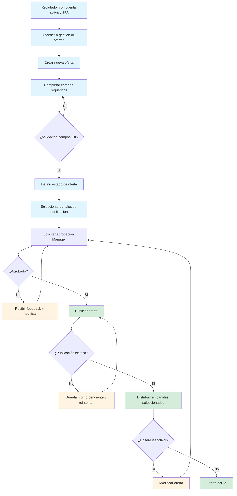
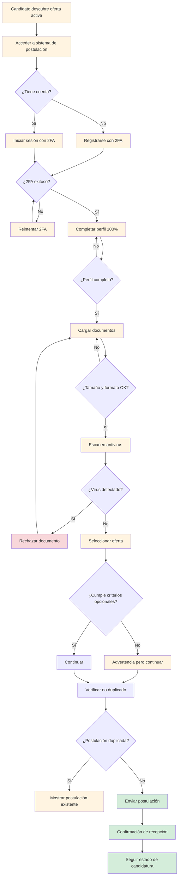
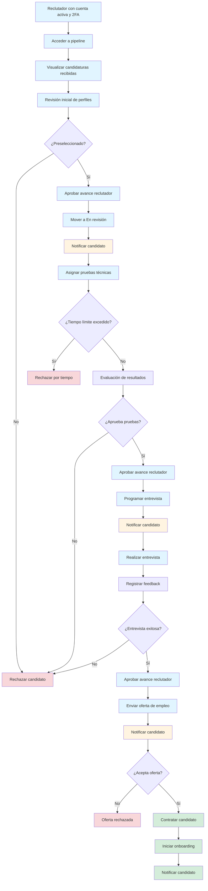
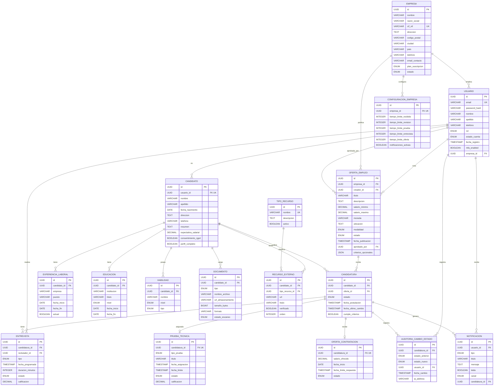
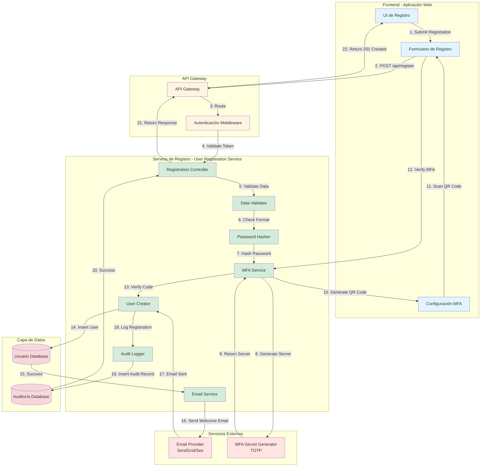

# Especificación del Proyecto: Sistema de Reclutamiento de Talento LTI

## Descripción General

Sistema de reclutamiento de talento que permite anunciar puestos de trabajo, publicarlos en redes sociales y medios, realizar pruebas a los candidatos, concretar entrevistas y finalmente contratar a candidatos.

## Valor Añadido y Ventajas Competitivas

### Para la Empresa

- **Reducción del tiempo de contratación**: Automatización de procesos reduce el tiempo desde publicación hasta contratación
- **Mejor calidad de contrataciones**: Sistema de filtrado y evaluaciones permite seleccionar candidatos más alineados con el perfil
- **Reducción de costos**: Menor gasto en publicaciones manuales, procesos administrativos y entrevistas innecesarias
- **Centralización de datos**: Toda la información de candidatos y procesos en un solo lugar, accesible y organizada
- **Mejor employer branding**: Proceso profesional y transparente mejora la imagen de la empresa
- **Métricas y analytics**: Datos para tomar decisiones basadas en evidencia y optimizar el proceso
- **Escalabilidad**: Capacidad de manejar mayor volumen de vacantes sin aumentar proporcionalmente el equipo
- **Cumplimiento normativo**: Registro documentado de todo el proceso de selección

### Para los Empleados (Reclutadores/RRHH)

- **Ahorro de tiempo administrativo**: Automatización de tareas repetitivas como comunicación y programación
- **Mejor organización**: Pipeline visual permite seguimiento claro del estado de cada candidato
- **Colaboración mejorada**: Comentarios y evaluaciones compartidas facilitan la toma de decisiones en equipo
- **Reducción de carga mental**: Recordatorios automáticos y notificaciones evitan olvidos
- **Acceso a historial**: Información completa de candidatos y procesos anteriores disponible rápidamente
- **Mejor experiencia de usuario**: Interfaz intuitiva reduce la curva de aprendizaje
- **Movilidad**: Acceso desde cualquier lugar para gestionar procesos fuera de la oficina

### Para los Candidatos

- **Experiencia simplificada**: Proceso de postulación intuitivo y rápido desde cualquier dispositivo
- **Transparencia**: Seguimiento del estado de su candidatura en tiempo real
- **Comunicación oportuna**: Notificaciones automáticas sobre avances en el proceso
- **Accesibilidad**: Disponibilidad 24/7 para revisar y aplicar a ofertas
- **Feedback estructurado**: Evaluaciones objetivas y consistentes para todos los candidatos
- **Reducción de la brecha**: Proceso estandarizado reduce sesgos en la selección
- **Profesionalismo**: Interacción con empresa moderna y tecnológicamente avanzada
- **Reutilización de perfil**: Información guardada para aplicar a futuras vacantes rápidamente

---

## Funcionalidades del Sistema
 
### Alta Prioridad
 
- **Gestión de ofertas de empleo**: Creación, edición, publicación y desactivación de puestos de trabajo con descripción detallada, requisitos, salario y ubicación
- **Gestión de candidatos**: Registro de perfiles, CVs, información de contacto y historial de candidaturas
- **Sistema de postulación**: Formulario de aplicación para candidatos con carga de documentos (CV, carta de presentación)
- **Pipeline de candidatos**: Kanban o flujo de estados (recibido, en revisión, prueba técnica, entrevista, oferta, contratado, rechazado)
- **Filtrado y búsqueda**: Búsqueda de candidatos por habilidades, experiencia, ubicación, educación y otros criterios
 
### Prioridad Media
 
- **Pruebas y evaluaciones**: Creación y asignación de pruebas técnicas, tests de habilidades, cuestionarios psicométricos
- **Gestión de entrevistas**: Programación, calendario, recordatorios, feedback y evaluación post-entrevista
- **Publicación multi-canal**: Integración con redes sociales (LinkedIn, Twitter, Facebook) y portales de empleo
- **Comunicación con candidatos**: Sistema de notificaciones, emails automáticos y mensajería interna
- **Reportes y analytics**: Métricas de tiempo de contratación, calidad de candidatos, fuentes de reclutamiento
 
### Prioridad Baja
 
- **Gestión de ofertas de contratación**: Generación y envío de cartas de oferta, seguimiento de aceptación
- **Onboarding básico**: Checklist de incorporación, documentación legal, asignación de recursos
- **Integraciones**: ATS externos, herramientas de videoconferencia, sistemas de RRHH
- **Colaboración interna**: Comentarios entre reclutadores, asignación de roles, permisos
- **Automatización avanzada**: Workflows personalizados, IA para matching candidato-puesto

---

## Lean Canvas - Modelo de Negocio LTI

### 1. Problema

**Problemas de los clientes (Empresas/RRHH):**
- Procesos de reclutamiento manuales y lentos
- Dificultad para gestionar grandes volúmenes de candidaturas
- Falta de centralización de información de candidatos
- Tiempos de contratación excesivos
- Ausencia de métricas para optimizar el proceso
- Comunicación fragmentada con candidatos
- Sesgos en la selección por falta de estandarización

**Problemas de los candidatos:**
- Falta de transparencia en el estado de su candidatura
- Procesos de postulación complejos y repetitivos
- Comunicación escasa o nula con las empresas
- Experiencia inconsistente entre diferentes empresas
- Dificultad para reutilizar su perfil en futuras oportunidades

### 2. Segmentos de Clientes

**Segmento Primario:**
- Empresas medianas y grandes (50-5000 empleados)
- Departamentos de RRHH y Talent Acquisition
- Startups en fase de crecimiento
- Agencias de reclutamiento

**Segmento Secundario:**
- Pequeñas empresas (10-50 empleados) con necesidades de hiring
- Consultoras de RRHH
- Empresas con alta rotación de personal

**Usuarios Finales:**
- Reclutadores y RRHH
- Hiring Managers
- Candidatos (usuarios del sistema)

### 3. Propuesta de Valor Única

**Para Empresas:**
- "Reduce tu tiempo de contratación en un 50% con automatización inteligente"
- "Centraliza todo tu proceso de reclutamiento en una plataforma intuitiva"
- "Toma decisiones basadas en datos con analytics en tiempo real"

**Para Candidatos:**
- "Experiencia de postulación transparente y profesional"
- "Seguimiento en tiempo real de tus candidaturas"
- "Un perfil para aplicar a múltiples oportunidades"

**Diferenciadores:**
- IA para matching candidato-puesto
- Colaboración en tiempo real entre reclutadores y managers
- Integración multi-canal nativa
- UX moderna y mobile-first

### 4. Solución

**Plataforma ATS con:**
- Gestión completa del ciclo de vida del candidato
- Pipeline visual tipo Kanban
- Sistema de evaluaciones técnicas integrado
- Programación automatizada de entrevistas
- Publicación multi-canal (redes sociales, portales)
- Sistema de notificaciones y comunicación
- Analytics y reportes avanzados
- IA para preselección y matching
- Portal de onboarding digital

### 5. Canales

**Adquisición de Clientes:**
- Marketing digital (SEO, SEM, LinkedIn Ads)
- Content marketing (blog, webinars, whitepapers)
- Ventas directas B2B
- Partnerships con consultoras de RRHH
- Presencia en eventos de HR Tech
- Free trial / Freemium para captación

**Canales de Distribución:**
- SaaS (Software as a Service) - web
- Demostraciones personalizadas
- Integraciones con herramientas existentes
- Marketplace de integraciones

### 6. Flujos de Ingresos

**Modelo de Suscripción:**
- **Starter**: $299/mes - hasta 50 vacantes activas
- **Professional**: $699/mes - hasta 200 vacantes activas + analytics avanzado
- **Enterprise**: $1,499+/mes - vacantes ilimitadas + API + soporte dedicado

**Ingresos Adicionales:**
- Integraciones premium ($99/mes cada una)
- Evaluaciones técnicas terceras ($5-15 por evaluación)
- Servicios de implementación ($2,000-10,000 one-time)
- Training y consultoría ($150/hora)

### 7. Estructura de Costos

**Costos Fijos:**
- Desarrollo y mantenimiento del software ($15,000-25,000/mes)
- Infraestructura cloud y servidores ($3,000-8,000/mes)
- Salarios del equipo (fundadores + desarrolladores + ventas)
- Oficina y operaciones ($5,000-10,000/mes)

**Costos Variables:**
- Marketing y adquisición de clientes ($500-2,000 por cliente)
- Costos de integraciones terceras
- Comisiones de ventas (10-20%)
- Soporte al cliente escalado

**Costos Únicos:**
- Desarrollo inicial del producto
- Certificaciones y compliance
- Branding y diseño

### 8. Métricas Clave

**Métricas de Adquisición:**
- CAC (Costo de Adquisición de Cliente)
- MRR/ARR (Monthly/Annual Recurring Revenue)
- Tasa de conversión de trial a pago
- Churn rate (tasa de cancelación)

**Métricas de Producto:**
- DAU/MAU (Daily/Monthly Active Users)
- Tiempo promedio de contratación (por cliente)
- Número de vacantes gestionadas
- Tasa de completitud de perfiles de candidatos

**Métricas de Satisfacción:**
- NPS (Net Promoter Score)
- CSAT (Customer Satisfaction Score)
- Tiempo de respuesta a soporte
- Tasa de adopción de funcionalidades

### 9. Ventaja Injusta

**Ventajas Competitivas:**
- **Tecnología propietaria de IA** para matching candidato-puesto
- **Experiencia del equipo** en HR Tech y reclutamiento
- **Integraciones nativas** con principales plataformas (LinkedIn, Indeed, etc.)
- **UX superior** basada en research profundo con usuarios
- **First-mover advantage** en ciertas funcionalidades de automatización
- **Comunidad activa** de reclutadores que generan feedback continuo
- **Data exclusiva** sobre tendencias de reclutamiento

---

## Diagrama Lean Canvas (Tabla)

| **Problema** | **Segmentos de Clientes** | **Propuesta de Valor Única** |
|--------------|---------------------------|------------------------------|
| • Procesos manuales lentos • Falta de centralización • Tiempos excesivos • Sin métricas • Comunicación fragmentada • Sesgos en selección • Falta transparencia candidatos • Procesos complejos postulación | • Empresas 50-5000 empleados • RRHH y Talent Acquisition • Startups en crecimiento • Agencias de reclutamiento • Pequeñas empresas 10-50 • Consultoras RRHH • Reclutadores • Hiring Managers • Candidatos | • Reduce tiempo 50% • Centralización total • Analytics en tiempo real • IA para matching • Colaboración real-time • Experiencia transparente • Seguimiento real-time • Perfil reutilizable |

| **Solución** | **Canales** | **Flujos de Ingresos** |
|---------------|-------------|------------------------|
| • Gestión ciclo completo • Pipeline Kanban • Evaluaciones técnicas • Programación entrevistas • Publicación multi-canal • Notificaciones • Analytics avanzados • IA preselección • Onboarding digital | • Marketing digital • Content marketing • Ventas B2B • Partnerships • Eventos HR Tech • Free trial • SaaS web • Demo personalizadas • Integraciones | • Starter: $299/mes • Professional: $699/mes • Enterprise: $1,499+/mes • Integraciones premium • Evaluaciones técnicas • Implementación • Training |

| **Estructura de Costos** | **Métricas Clave** | **Ventaja Injusta** |
|---------------------------|---------------------|---------------------|
| • Desarrollo: $15-25K/mes • Infraestructura: $3-8K/mes • Salarios equipo • Oficina: $5-10K/mes • Marketing por cliente • Comisiones ventas | • CAC • MRR/ARR • Conversión trial • Churn rate • DAU/MAU • Tiempo contratación • NPS • CSAT | • IA propietaria • Experiencia equipo • Integraciones nativas • UX superior • First-mover • Comunidad activa • Data exclusiva |

---

## Casos de Uso Principales

### Caso de Uso 1: Gestión de Ofertas de Empleo

**Descripción:**
Este caso de uso permite a los reclutadores y RRHH crear, editar, publicar y gestionar ofertas de empleo en el sistema. Incluye la definición de detalles del puesto, requisitos, salario, ubicación y la publicación en múltiples canales.

**Actores:**
- Reclutador/RRHH
- Hiring Manager

**Estados Previos Requeridos:**
- El reclutador debe tener una cuenta activa con permisos de "Gestión de Ofertas"
- El reclutador debe haber completado la autenticación de doble factor (2FA)
- La empresa debe tener configurados los canales de publicación

**Flujo Principal:**
1. El reclutador accede al módulo de gestión de ofertas
2. Crea una nueva oferta de empleo
3. Completa los campos requeridos (título, descripción, requisitos, salario, ubicación)
4. Define el estado de la oferta (borrador, activa, pausada, cerrada)
5. Selecciona los canales de publicación (redes sociales, portales de empleo)
6. Solicita aprobación del Hiring Manager
7. El Manager aprueba la oferta
8. Publica la oferta
9. La oferta se distribuye en los canales seleccionados
10. El reclutador puede editar o desactivar la oferta en cualquier momento

**Flujos Alternativos:**
- **Flujo Alternativo 1: Rechazo de aprobación**
  - Si el Manager rechaza la oferta, el reclutador recibe notificación con feedback
  - El reclutador puede modificar la oferta y solicitar aprobación nuevamente

- **Flujo Alternativo 2: Edición de oferta publicada**
  - Si el reclutador edita una oferta ya publicada, debe solicitar aprobación nuevamente
  - Los cambios no se aplican hasta la aprobación del Manager

- **Flujo Alternativo 3: Error en publicación de canales**
  - Si falla la publicación en algún canal, el sistema notifica al reclutador
  - La oferta permanece publicada en los canales exitosos
  - El reclutador puede reintentar la publicación en el canal fallido

**Manejo de Errores y Excepciones:**
- **Error de validación de campos**: Si algún campo tiene formato inválido, el sistema muestra error específico y no permite guardar
- **Error de conexión con canales externos**: Si falla la conexión con redes sociales/portales, se guarda la oferta en estado "Pendiente de publicación" y se reintentará automáticamente
- **Error de autenticación 2FA**: Si falla la autenticación, se solicita nuevamente después de 3 intentos fallidos se bloquea temporalmente la cuenta
- **Error de aprobación pendiente**: Si el Manager no responde en 48 horas, se envía recordatorio automático

**Casos Borde:**
- Crear oferta con campos extremadamente largos (límite de caracteres)
- Publicar oferta con salario en formato no estándar
- Editar oferta mientras tiene candidaturas activas
- Desactivar oferta con candidatos en proceso de selección
- Publicar oferta en canales que no están configurados

**Criterios de Aceptación:**
- Todos los campos obligatorios deben estar completos antes de publicarse
- Validación de formato para email (formato estándar RFC 5322)
- Validación de formato para teléfono (números internacionales con código de país)
- Validación de formato para salario (numérico, moneda, periodicidad)
- Requiere aprobación obligatoria del Hiring Manager antes de publicarse
- Sin límite de ofertas activas simultáneas
- Cumplimiento con RGPD: datos sensibles de candidatos no visibles en oferta pública

**Validaciones y Reglas de Negocio:**
- **Validaciones de datos**:
  - Título: 5-100 caracteres, sin caracteres especiales peligrosos
  - Descripción: 50-5000 caracteres, sanitización de HTML
  - Email: formato válido, verificación de dominio
  - Teléfono: formato internacional + código país
  - Salario: numérico positivo, rango válido según mercado
  - Ubicación: validación de código postal/país

- **Reglas de negocio**:
  - Una oferta no puede ser publicada sin aprobación del Manager
  - Las ofertas con candidaturas activas no pueden ser eliminadas, solo desactivadas
  - Los cambios en ofertas publicadas requieren aprobación nuevamente
  - El reclutador debe tener permisos específicos para gestionar ofertas
  - Se debe cumplir con RGPD: no incluir información personal en ofertas públicas

---

### Caso de Uso 2: Postulación de Candidatos

**Descripción:**
Este caso de uso permite a los candidatos registrarse en el sistema, completar su perfil, cargar documentos y postularse a ofertas de empleo disponibles. Incluye el seguimiento del estado de su candidatura en tiempo real.

**Actores:**
- Candidato

**Estados Previos Requeridos:**
- El candidato debe tener una cuenta activa
- El candidato debe haber completado la autenticación de doble factor (2FA)
- El perfil del candidato debe estar 100% completo
- La oferta de empleo debe estar en estado "Activa"

**Flujo Principal:**
1. El candidato descubre una oferta de empleo
2. Accede al sistema de postulación
3. Se registra o inicia sesión con 2FA
4. Completa su perfil al 100% (información personal, experiencia, educación, habilidades)
5. Carga documentos requeridos (CV, carta de presentación)
6. El sistema escanea los documentos con antivirus
7. Si los documentos están limpios, continúa
8. Selecciona la oferta a la que desea postularse
9. Verifica que cumple con criterios opcionales de la oferta (si existen)
10. El sistema verifica que no haya postulación duplicada
11. Envía su postulación
12. Recibe confirmación de recepción
13. Puede seguir el estado de su candidatura en tiempo real

**Flujos Alternativos:**
- **Flujo Alternativo 1: Perfil incompleto**
  - Si el perfil no está 100% completo, el sistema bloquea la postulación
  - Muestra campos faltantes y no permite continuar hasta completarlos

- **Flujo Alternativo 2: Documento con virus detectado**
  - Si el antivirus detecta malware, el documento es rechazado
  - El candidato recibe notificación del problema
  - Debe cargar un documento limpio para continuar

- **Flujo Alternativo 3: Postulación duplicada**
  - Si el candidato ya se postuló a esta oferta, el sistema lo notifica
  - No permite crear una nueva postulación duplicada
  - El candidato puede ver su postulación existente

- **Flujo Alternativo 4: No cumple criterios opcionales**
  - Si la oferta tiene criterios opcionales y el candidato no los cumple
  - El sistema muestra advertencia pero permite postularse
  - El reclutador verá que no cumple los criterios opcionales

**Manejo de Errores y Excepciones:**
- **Error de validación de perfil**: Si el perfil no está 100% completo, el sistema muestra campos faltantes y bloquea postulación
- **Error de tamaño de documento**: Si el documento excede 10MB, el sistema rechaza la carga y muestra mensaje específico
- **Error de formato de archivo**: Si el archivo no es formato permitido (PDF, Word), el sistema rechaza la carga
- **Error de antivirus**: Si el antivirus detecta amenaza, el documento es eliminado y se notifica al candidato
- **Error de autenticación 2FA**: Si falla la autenticación, se solicita nuevamente, después de 3 intentos fallidos se bloquea temporalmente
- **Error de conexión**: Si falla la carga de documentos, se permite reintentar sin perder datos del formulario

**Casos Borde:**
- Cargar documento exactamente de 10MB (límite máximo)
- Intentar postularse a oferta inactiva o cerrada
- Postularse con múltiples documentos simultáneamente
- Intentar postularse sin completar campos opcionales del perfil
- Cargar documento con nombre de archivo extremadamente largo
- Postularse inmediatamente después de registrarse (primer uso)

**Criterios de Aceptación:**
- El perfil debe estar 100% completo para poder postularse
- Límite de 10MB por documento
- Validación de formato de archivos: solo PDF (.pdf), Word (.doc, .docx)
- Revisión por antivirus de todos los documentos cargados
- Sin límite de postulaciones por candidato
- No puede haber postulaciones duplicadas a la misma oferta
- Cumplimiento con RGPD: consentimiento explícito para tratamiento de datos
- Autenticación 2FA obligatoria para acceder al sistema

**Validaciones y Reglas de Negocio:**
- **Validaciones de datos**:
  - Nombre: 2-50 caracteres, solo letras y espacios
  - Email: formato válido RFC 5322, verificación de dominio
  - Teléfono: formato internacional + código país
  - CV: máximo 10MB, formatos PDF/Word
  - Carta de presentación: máximo 10MB, formatos PDF/Word
  - Experiencia: validación de fechas (no futuras)
  - Educación: validación de instituciones y títulos

- **Reglas de negocio**:
  - No puede haber postulaciones duplicadas a la misma oferta
  - Se pueden establecer criterios opcionales para postular (configuración del reclutador)
  - El perfil debe estar 100% completo para postular
  - Todos los documentos pasan por escaneo antivirus
  - Cumplimiento con RGPD: consentimiento explícito, derecho al olvido, portabilidad de datos
  - Autenticación 2FA obligatoria para todas las acciones
  - Los datos del candidato se almacenan encriptados

---

### Caso de Uso 3: Pipeline de Candidatos

**Descripción:**
Este caso de uso permite a los reclutadores gestionar el flujo de candidatos a través de las diferentes etapas del proceso de selección. Incluye la revisión inicial, asignación de pruebas técnicas, programación de entrevistas, envío de ofertas y gestión de contrataciones.

**Actores:**
- Reclutador/RRHH
- Hiring Manager

**Estados Previos Requeridos:**
- El reclutador debe tener una cuenta activa con permisos de "Gestión de Pipeline"
- El reclutador debe haber completado la autenticación de doble factor (2FA)
- Debe haber candidaturas en estado "Recibido" disponibles para revisión
- Los límites de tiempo por etapa deben estar configurados (configuración variable por empresa)

**Flujo Principal:**
1. El reclutador accede al pipeline de candidatos
2. Visualiza las candidaturas en estado "Recibido"
3. Realiza revisión inicial de perfiles
4. Aprueba el avance del candidato (solo requiere aprobación de un reclutador)
5. Mueve candidatos preseleccionados a "En revisión"
6. El sistema envía notificación al candidato del cambio de estado
7. Asigna pruebas técnicas a candidatos cualificados
8. El candidato completa las pruebas dentro del límite de tiempo configurado
9. Evalúa resultados de pruebas
10. Aprueba el avance del candidato
11. Programa entrevistas con candidatos que pasan las pruebas
12. El sistema envía notificación al candidato con detalles de entrevista
13. Realiza entrevistas y registra feedback
14. Aprueba el avance del candidato
15. Envía oferta de empleo al candidato seleccionado
16. El sistema envía notificación al candidato con la oferta
17. Gestiona aceptación/rechazo de oferta
18. Mueve a "Contratado" o "Rechazado" según corresponda
19. El sistema envía notificación final al candidato

**Flujos Alternativos:**
- **Flujo Alternativo 1: Candidato no completa pruebas en tiempo**
  - Si el candidato no completa las pruebas dentro del límite de tiempo configurado
  - El sistema mueve automáticamente al candidato a "Rechazado por tiempo"
  - Se envía notificación al candidato explicando la situación

- **Flujo Alternativo 2: Rechazo en cualquier etapa**
  - Si el reclutador rechaza al candidato en cualquier etapa
  - El candidato se mueve a "Rechazado"
  - Se envía notificación al candidato con feedback (si está configurado)

- **Flujo Alternativo 3: Candidato rechaza oferta**
  - Si el candidato rechaza la oferta de empleo
  - El candidato se mueve a "Oferta rechazada"
  - Se mantiene en el sistema para futuras oportunidades
  - Se envía notificación al reclutador

- **Flujo Alternativo 4: Reconsideración de candidato**
  - Si un candidato fue rechazado pero el reclutador quiere reconsiderarlo
  - El reclutador puede moverlo de vuelta a una etapa anterior
  - Se envía notificación al candidato del cambio de estado

**Manejo de Errores y Excepciones:**
- **Error de límite de tiempo excedido**: Si el candidato excede el tiempo en una etapa, el sistema notifica y puede mover automáticamente a rechazado según configuración
- **Error de notificación fallida**: Si falla el envío de notificación al candidato, el sistema reintentará automáticamente 3 veces
- **Error de autenticación 2FA**: Si falla la autenticación, se solicita nuevamente, después de 3 intentos fallidos se bloquea temporalmente
- **Error de programación de entrevista**: Si falla la integración con calendario externo, se permite programación manual
- **Error de envío de oferta**: Si falla el envío de la oferta por email, se notifica al reclutador para reintentar manualmente
- **Error de cambio de estado no permitido**: Si el reclutador intenta mover un candidato a un estado no válido, el sistema muestra error y bloquea la acción

**Casos Borde:**
- Mover candidato de "Recibido" directamente a "Entrevista" (saltando etapas)
- Configurar límite de tiempo de 0 horas (sin límite)
- Tener múltiples candidatos en la misma etapa simultáneamente
- Rechazar candidato que ya está en "Oferta enviada"
- Mover candidato de "Rechazado" a "Contratado" (flujo reverso)
- Programar entrevista para fecha/hora ya pasada

**Criterios de Aceptación:**
- Límite de tiempo variable y configurable para cada paso del pipeline
- Solo se requiere una aprobación de reclutador para poder avanzar
- Notificaciones obligatorias en cada cambio de estado
- Sin límite de candidatos en las etapas
- Cumplimiento con RGPD: acceso controlado a datos del candidato
- Autenticación 2FA obligatoria para cualquier cambio de estado
- El sistema debe registrar todos los cambios de estado con timestamp y usuario

**Validaciones y Reglas de Negocio:**
- **Validaciones de datos**:
  - Feedback de entrevista: texto libre, máximo 2000 caracteres, sanitización de HTML
  - Calificación de prueba: numérico 0-100, obligatorio para avanzar
  - Fecha de entrevista: no puede ser en el pasado, máximo 6 meses en el futuro
  - Salario de oferta: numérico positivo, rango válido según mercado
  - Notas del reclutador: texto libre, máximo 1000 caracteres

- **Reglas de negocio**:
  - Los límites de tiempo por etapa son configurables por la empresa
  - Solo un reclutador necesita aprobar para avanzar (no requiere aprobación múltiple)
  - Notificaciones automáticas en cada cambio de estado
  - Sin límite de candidatos por etapa
  - Los candidatos rechazados pueden ser reconsiderados (movidos a etapas anteriores)
  - Cumplimiento con RGPD: solo usuarios autorizados pueden ver datos completos del candidato
  - Autenticación 2FA obligatoria para cualquier acción en el pipeline
  - Todos los cambios de estado se registran en auditoría con usuario y timestamp

---

## Modelo de Datos

### Entidades Principales

#### 1. Usuario
Representa a todos los usuarios del sistema (reclutadores, hiring managers, candidatos).

| Atributo | Tipo | Descripción | Restricciones |
|----------|------|-------------|---------------|
| id | UUID | Identificador único del usuario | PK, Not Null |
| email | VARCHAR(255) | Email del usuario | Unique, Not Null, RFC 5322 |
| password_hash | VARCHAR(255) | Hash de la contraseña | Not Null, Encriptado |
| nombre | VARCHAR(50) | Nombre del usuario | Not Null, Solo letras |
| apellido | VARCHAR(50) | Apellido del usuario | Not Null, Solo letras |
| telefono | VARCHAR(20) | Teléfono con código país | Formato internacional |
| rol | ENUM | Rol del usuario (RECLUTADOR, MANAGER, CANDIDATO) | Not Null |
| estado_cuenta | ENUM | Estado de la cuenta (ACTIVA, BLOQUEADA, PENDIENTE) | Not Null |
| fecha_registro | TIMESTAMP | Fecha y hora de registro | Not Null, Default NOW() |
| ultimo_acceso | TIMESTAMP | Último acceso al sistema | Nullable |
| mfa_enabled | BOOLEAN | Autenticación de doble factor activada | Not Null, Default TRUE |
| mfa_secret | VARCHAR(255) | Secreto para 2FA | Encriptado, Nullable |
| intentos_fallidos | INTEGER | Contador de intentos fallidos de login | Default 0 |
| empresa_id | UUID | ID de la empresa (para reclutadores) | FK, Nullable |

#### 2. Empresa
Representa a las empresas que utilizan el sistema.

| Atributo | Tipo | Descripción | Restricciones |
|----------|------|-------------|---------------|
| id | UUID | Identificador único de la empresa | PK, Not Null |
| nombre | VARCHAR(100) | Nombre de la empresa | Not Null |
| razon_social | VARCHAR(100) | Razón social legal | Not Null |
| cif_nif | VARCHAR(20) | CIF/NIF de la empresa | Unique, Not Null |
| direccion | TEXT | Dirección física | Not Null |
| codigo_postal | VARCHAR(10) | Código postal | Not Null |
| ciudad | VARCHAR(50) | Ciudad | Not Null |
| pais | VARCHAR(50) | País | Not Null, ISO 3166 |
| telefono | VARCHAR(20) | Teléfono de contacto | Not Null |
| email_contacto | VARCHAR(255) | Email de contacto general | Not Null |
| logo_url | VARCHAR(500) | URL del logo de la empresa | Nullable |
| plan_suscripcion | ENUM | Plan de suscripción (STARTER, PROFESSIONAL, ENTERPRISE) | Not Null |
| fecha_alta | TIMESTAMP | Fecha de alta en el sistema | Not Null, Default NOW() |
| estado | ENUM | Estado (ACTIVA, SUSPENDIDA, CANCELADA) | Not Null |

#### 3. OfertaEmpleo
Representa las ofertas de empleo publicadas por las empresas.

| Atributo | Tipo | Descripción | Restricciones |
|----------|------|-------------|---------------|
| id | UUID | Identificador único de la oferta | PK, Not Null |
| empresa_id | UUID | ID de la empresa | FK, Not Null |
| creador_id | UUID | ID del reclutador que creó la oferta | FK, Not Null |
| titulo | VARCHAR(100) | Título del puesto | Not Null, 5-100 caracteres |
| descripcion | TEXT | Descripción detallada del puesto | Not Null, 50-5000 caracteres |
| requisitos | TEXT | Requisitos del puesto | Nullable |
| salario_minimo | DECIMAL(10,2) | Salario mínimo ofertado | Nullable, Positivo |
| salario_maximo | DECIMAL(10,2) | Salario máximo ofertado | Nullable, Positivo |
| moneda | VARCHAR(3) | Moneda del salario | Default EUR, ISO 4217 |
| periodicidad_salario | ENUM | Periodicidad (HORA, MES, ANIO) | Nullable |
| ubicacion | TEXT | Ubicación del puesto | Not Null |
| modalidad | ENUM | Modalidad (PRESENCIAL, REMOTO, HIBRIDO) | Not Null |
| tipo_contrato | ENUM | Tipo de contrato (INDEFINIDO, TEMPORAL, PRACTICAS) | Nullable |
| jornada | ENUM | Jornada (COMPLETA, PARCIAL) | Nullable |
| estado | ENUM | Estado (BORRADOR, ACTIVA, PAUSADA, CERRADA) | Not Null |
| fecha_publicacion | TIMESTAMP | Fecha de publicación | Nullable |
| fecha_cierre | TIMESTAMP | Fecha de cierre de la oferta | Nullable |
| aprobado_por | UUID | ID del manager que aprobó | FK, Nullable |
| fecha_aprobacion | TIMESTAMP | Fecha de aprobación | Nullable |
| criterios_opcionales | JSON | Criterios opcionales para postular | Nullable |
| created_at | TIMESTAMP | Fecha de creación | Not Null, Default NOW() |
| updated_at | TIMESTAMP | Fecha de última actualización | Not Null, Default NOW() |

#### 4. Candidato
Representa el perfil de un candidato.

| Atributo | Tipo | Descripción | Restricciones |
|----------|------|-------------|---------------|
| id | UUID | Identificador único del candidato | PK, Not Null |
| usuario_id | UUID | ID del usuario asociado | FK, Unique, Not Null |
| nombre | VARCHAR(50) | Nombre | Not Null |
| apellido | VARCHAR(50) | Apellido | Not Null |
| fecha_nacimiento | DATE | Fecha de nacimiento | Nullable |
| nacionalidad | VARCHAR(50) | Nacionalidad | Nullable |
| direccion | TEXT | Dirección | Nullable |
| codigo_postal | VARCHAR(10) | Código postal | Nullable |
| ciudad | VARCHAR(50) | Ciudad | Nullable |
| pais | VARCHAR(50) | País | Nullable, ISO 3166 |
| telefono | VARCHAR(20) | Teléfono | Nullable |
| resumen | TEXT | Resumen profesional | Nullable, Máx 2000 caracteres |
| disponibilidad | ENUM | Disponibilidad (INMEDIATA, 1_SEMANA, 1_MES, 3_MESES) | Nullable |
| expectativa_salarial | DECIMAL(10,2) | Expectativa salarial | Nullable |
| consentimiento_rgpd | BOOLEAN | Consentimiento RGPD | Not Null, Default FALSE |
| fecha_consentimiento | TIMESTAMP | Fecha del consentimiento | Nullable |
| perfil_completo | BOOLEAN | Indica si el perfil está 100% completo | Not Null, Default FALSE |
| created_at | TIMESTAMP | Fecha de creación | Not Null, Default NOW() |
| updated_at | TIMESTAMP | Fecha de última actualización | Not Null, Default NOW() |

#### 5. TipoRecurso
Representa los tipos de recursos externos que puede tener un candidato.

| Atributo | Tipo | Descripción | Restricciones |
|----------|------|-------------|---------------|
| id | UUID | Identificador único del tipo de recurso | PK, Not Null |
| nombre | VARCHAR(50) | Nombre del tipo de recurso | Unique, Not Null |
| descripcion | TEXT | Descripción del tipo de recurso | Nullable |
| activo | BOOLEAN | Indica si el tipo está activo | Not Null, Default TRUE |
| created_at | TIMESTAMP | Fecha de creación | Not Null, Default NOW() |

**Tipos predefinidos:** LINKEDIN, GITHUB, PORTAFOLIO, BEHANCE, DRIBBBLE, STACKOVERFLOW, PERSONAL_BLOG, OTRO

#### 6. RecursoExterno
Representa los recursos externos (URLs) asociados a un candidato.

| Atributo | Tipo | Descripción | Restricciones |
|----------|------|-------------|---------------|
| id | UUID | Identificador único del recurso | PK, Not Null |
| candidato_id | UUID | ID del candidato | FK, Not Null |
| tipo_recurso_id | UUID | ID del tipo de recurso | FK, Not Null |
| url | VARCHAR(500) | URL del recurso externo | Not Null |
| titulo | VARCHAR(100) | Título descriptivo del recurso | Nullable |
| verificado | BOOLEAN | Indica si la URL ha sido verificada | Not Null, Default FALSE |
| fecha_verificacion | TIMESTAMP | Fecha de verificación de la URL | Nullable |
| orden | INTEGER | Orden de visualización | Nullable |
| created_at | TIMESTAMP | Fecha de creación | Not Null, Default NOW() |
| updated_at | TIMESTAMP | Fecha de última actualización | Not Null, Default NOW() |

**Índice único:** (candidato_id, tipo_recurso_id) - Permite un solo recurso de cada tipo por candidato

#### 7. ExperienciaLaboral
Representa la experiencia laboral de un candidato.

| Atributo | Tipo | Descripción | Restricciones |
|----------|------|-------------|---------------|
| id | UUID | Identificador único | PK, Not Null |
| candidato_id | UUID | ID del candidato | FK, Not Null |
| empresa | VARCHAR(100) | Nombre de la empresa | Not Null |
| puesto | VARCHAR(100) | Puesto desempeñado | Not Null |
| descripcion | TEXT | Descripción de responsabilidades | Nullable |
| fecha_inicio | DATE | Fecha de inicio | Not Null |
| fecha_fin | DATE | Fecha de fin | Nullable |
| actual | BOOLEAN | Indica si es el empleo actual | Not Null, Default FALSE |
| created_at | TIMESTAMP | Fecha de creación | Not Null, Default NOW() |

#### 8. Educacion
Representa la educación de un candidato.

| Atributo | Tipo | Descripción | Restricciones |
|----------|------|-------------|---------------|
| id | UUID | Identificador único | PK, Not Null |
| candidato_id | UUID | ID del candidato | FK, Not Null |
| institucion | VARCHAR(100) | Nombre de la institución | Not Null |
| titulo | VARCHAR(100) | Título obtenido | Not Null |
| nivel | ENUM | Nivel (SECUNDARIA, GRADO, MASTER, DOCTORADO) | Not Null |
| area_estudio | VARCHAR(100) | Área de estudio | Nullable |
| fecha_inicio | DATE | Fecha de inicio | Not Null |
| fecha_fin | DATE | Fecha de fin | Nullable |
| actual | BOOLEAN | Indica si es actual | Not Null, Default FALSE |
| created_at | TIMESTAMP | Fecha de creación | Not Null, Default NOW() |

#### 9. Habilidad
Representa las habilidades de un candidato.

| Atributo | Tipo | Descripción | Restricciones |
|----------|------|-------------|---------------|
| id | UUID | Identificador único | PK, Not Null |
| candidato_id | UUID | ID del candidato | FK, Not Null |
| nombre | VARCHAR(100) | Nombre de la habilidad | Not Null |
| nivel | ENUM | Nivel (PRINCIPIANTE, INTERMEDIO, AVANZADO, EXPERTO) | Not Null |
| tipo | ENUM | Tipo (TECNICA, BLANDA, IDIOMA) | Not Null |
| created_at | TIMESTAMP | Fecha de creación | Not Null, Default NOW() |

#### 10. Documento
Representa los documentos cargados por candidatos.

| Atributo | Tipo | Descripción | Restricciones |
|----------|------|-------------|---------------|
| id | UUID | Identificador único | PK, Not Null |
| candidato_id | UUID | ID del candidato | FK, Not Null |
| tipo | ENUM | Tipo (CV, CARTA_PRESENTACION, PORTAFOLIO, CERTIFICADO) | Not Null |
| nombre_archivo | VARCHAR(255) | Nombre original del archivo | Not Null |
| url_almacenamiento | VARCHAR(500) | URL de almacenamiento | Not Null |
| tamaño_bytes | BIGINT | Tamaño en bytes | Not Null, Máx 10MB |
| formato | VARCHAR(10) | Formato del archivo (pdf, doc, docx) | Not Null |
| contenido_hash | VARCHAR(64) | Hash del contenido para verificación | Not Null |
| estado_escaneo | ENUM | Estado del escaneo antivirus (PENDIENTE, LIMPIO, INFECTADO) | Not Null |
| fecha_escaneo | TIMESTAMP | Fecha del escaneo antivirus | Nullable |
| created_at | TIMESTAMP | Fecha de carga | Not Null, Default NOW() |

#### 11. Candidatura
Representa la postulación de un candidato a una oferta.

| Atributo | Tipo | Descripción | Restricciones |
|----------|------|-------------|---------------|
| id | UUID | Identificador único | PK, Not Null |
| candidato_id | UUID | ID del candidato | FK, Not Null |
| oferta_id | UUID | ID de la oferta | FK, Not Null |
| estado | ENUM | Estado (RECIBIDO, EN_REVISION, PRUEBA_TECNICA, ENTREVISTA, OFERTA, CONTRATADO, RECHAZADO, OFERTA_RECHAZADA) | Not Null |
| fecha_postulacion | TIMESTAMP | Fecha de postulación | Not Null, Default NOW() |
| fecha_ultimo_cambio | TIMESTAMP | Fecha del último cambio de estado | Not Null, Default NOW() |
| notas_candidato | TEXT | Notas adicionales del candidato | Nullable, Máx 1000 caracteres |
| cumple_criterios | BOOLEAN | Indica si cumple criterios opcionales | Nullable |
| created_at | TIMESTAMP | Fecha de creación | Not Null, Default NOW() |
| updated_at | TIMESTAMP | Fecha de última actualización | Not Null, Default NOW() |

**Índice único:** (candidato_id, oferta_id) - Evita postulaciones duplicadas

#### 12. PruebaTecnica
Representa las pruebas técnicas asignadas.

| Atributo | Tipo | Descripción | Restricciones |
|----------|------|-------------|---------------|
| id | UUID | Identificador único | PK, Not Null |
| candidatura_id | UUID | ID de la candidatura | FK, Unique, Not Null |
| tipo_prueba | ENUM | Tipo (CODIGO, TEST_HABILIDADES, PSICOMETRICO) | Not Null |
| titulo | VARCHAR(100) | Título de la prueba | Not Null |
| descripcion | TEXT | Descripción de la prueba | Nullable |
| url_prueba | VARCHAR(500) | URL de la prueba | Nullable |
| fecha_asignacion | TIMESTAMP | Fecha de asignación | Not Null, Default NOW() |
| fecha_limite | TIMESTAMP | Fecha límite para completar | Not Null |
| estado | ENUM | Estado (ASIGNADA, EN_PROGRESO, COMPLETADA, EXPIRADA) | Not Null |
| calificacion | DECIMAL(5,2) | Calificación obtenida (0-100) | Nullable |
| feedback | TEXT | Feedback de la prueba | Nullable, Máx 2000 caracteres |
| fecha_completacion | TIMESTAMP | Fecha de completación | Nullable |
| created_at | TIMESTAMP | Fecha de creación | Not Null, Default NOW() |

#### 13. Entrevista
Representa las entrevistas programadas.

| Atributo | Tipo | Descripción | Restricciones |
|----------|------|-------------|---------------|
| id | UUID | Identificador único | PK, Not Null |
| candidatura_id | UUID | ID de la candidatura | FK, Not Null |
| reclutador_id | UUID | ID del reclutador | FK, Not Null |
| tipo | ENUM | Tipo (VIDEO, PRESENCIAL, TELEFONICA) | Not Null |
| fecha_programada | TIMESTAMP | Fecha y hora programada | Not Null, No pasado, Máx 6 meses futuro |
| duracion_minutos | INTEGER | Duración estimada en minutos | Not Null |
| ubicacion | TEXT | Ubicación o enlace de videoconferencia | Nullable |
| estado | ENUM | Estado (PROGRAMADA, COMPLETADA, CANCELADA, REPROGRAMADA) | Not Null |
| feedback | TEXT | Feedback de la entrevista | Nullable, Máx 2000 caracteres |
| calificacion | DECIMAL(5,2) | Calificación (0-100) | Nullable |
| fecha_realizacion | TIMESTAMP | Fecha de realización | Nullable |
| created_at | TIMESTAMP | Fecha de creación | Not Null, Default NOW() |

#### 14. OfertaContratacion
Representa las ofertas de contratación enviadas a candidatos.

| Atributo | Tipo | Descripción | Restricciones |
|----------|------|-------------|---------------|
| id | UUID | Identificador único | PK, Not Null |
| candidatura_id | UUID | ID de la candidatura | FK, Unique, Not Null |
| salario_ofrecido | DECIMAL(10,2) | Salario ofrecido | Not Null, Positivo |
| moneda | VARCHAR(3) | Moneda | Default EUR, ISO 4217 |
| beneficios | TEXT | Beneficios adicionales | Nullable |
| fecha_inicio | DATE | Fecha de inicio propuesta | Not Null |
| fecha_limite_respuesta | TIMESTAMP | Fecha límite para responder | Not Null |
| estado | ENUM | Estado (ENVIADA, ACEPTADA, RECHAZADA, EXPIRADA) | Not Null |
| fecha_envio | TIMESTAMP | Fecha de envío | Not Null, Default NOW() |
| fecha_respuesta | TIMESTAMP | Fecha de respuesta | Nullable |
| notas | TEXT | Notas adicionales | Nullable, Máx 1000 caracteres |
| created_at | TIMESTAMP | Fecha de creación | Not Null, Default NOW() |

#### 15. Notificacion
Representa las notificaciones enviadas a usuarios.

| Atributo | Tipo | Descripción | Restricciones |
|----------|------|-------------|---------------|
| id | UUID | Identificador único | PK, Not Null |
| usuario_id | UUID | ID del usuario destinatario | FK, Not Null |
| tipo | ENUM | Tipo (CAMBIO_ESTADO, NUEVA_OFERTA, ENTREVISTA, PRUEBA, OFERTA_CONTRATACION) | Not Null |
| titulo | VARCHAR(200) | Título de la notificación | Not Null |
| mensaje | TEXT | Contenido del mensaje | Not Null |
| leida | BOOLEAN | Indica si fue leída | Not Null, Default FALSE |
| fecha_envio | TIMESTAMP | Fecha de envío | Not Null, Default NOW() |
| fecha_lectura | TIMESTAMP | Fecha de lectura | Nullable |
| canal | ENUM | Canal (EMAIL, PUSH, SMS) | Not Null |
| candidatura_id | UUID | ID de la candidatura relacionada | FK, Nullable |
| created_at | TIMESTAMP | Fecha de creación | Not Null, Default NOW() |

#### 16. ConfiguracionEmpresa
Representa la configuración personalizada por empresa.

| Atributo | Tipo | Descripción | Restricciones |
|----------|------|-------------|---------------|
| id | UUID | Identificador único | PK, Not Null |
| empresa_id | UUID | ID de la empresa | FK, Unique, Not Null |
| tiempo_limite_recibido | INTEGER | Horas límite en estado RECIBIDO | Nullable |
| tiempo_limite_revision | INTEGER | Horas límite en estado EN_REVISION | Nullable |
| tiempo_limite_prueba | INTEGER | Horas límite en estado PRUEBA_TECNICA | Nullable |
| tiempo_limite_entrevista | INTEGER | Horas límite en estado ENTREVISTA | Nullable |
| tiempo_limite_oferta | INTEGER | Horas límite en estado OFERTA | Nullable |
| notificaciones_activas | BOOLEAN | Notificaciones automáticas activas | Not Null, Default TRUE |
| feedback_rechazo | BOOLEAN | Enviar feedback al rechazar | Not Null, Default FALSE |
| canales_publicacion | JSON | Canales de publicación configurados | Nullable |
| created_at | TIMESTAMP | Fecha de creación | Not Null, Default NOW() |
| updated_at | TIMESTAMP | Fecha de última actualización | Not Null, Default NOW() |

#### 17. AuditoriaCambioEstado
Representa el registro de auditoría de cambios de estado.

| Atributo | Tipo | Descripción | Restricciones |
|----------|------|-------------|---------------|
| id | UUID | Identificador único | PK, Not Null |
| candidatura_id | UUID | ID de la candidatura | FK, Not Null |
| estado_anterior | ENUM | Estado anterior | Not Null |
| estado_nuevo | ENUM | Estado nuevo | Not Null |
| usuario_id | UUID | ID del usuario que realizó el cambio | FK, Not Null |
| fecha_cambio | TIMESTAMP | Fecha y hora del cambio | Not Null, Default NOW() |
| comentarios | TEXT | Comentarios sobre el cambio | Nullable |
| ip_address | VARCHAR(45) | Dirección IP del usuario | Nullable |

### Relaciones entre Entidades

### Descripción de Relaciones

- **USUARIO - CANDIDATO**: Un usuario puede tener un perfil de candidato (1:0..1)
- **USUARIO - OFERTA_EMPLEO**: Un usuario (reclutador) puede crear múltiples ofertas (1:N)
- **USUARIO - ENTREVISTA**: Un usuario (reclutador) puede realizar múltiples entrevistas (1:N)
- **EMPRESA - USUARIO**: Una empresa puede tener múltiples usuarios (reclutadores) (1:N)
- **EMPRESA - OFERTA_EMPLEO**: Una empresa puede publicar múltiples ofertas (1:N)
- **OFERTA_EMPLEO - CANDIDATURA**: Una oferta puede recibir múltiples candidaturas (1:N)
- **CANDIDATO - CANDIDATURA**: Un candidato puede realizar múltiples candidaturas (1:N)
- **CANDIDATO - RECURSO_EXTERNO**: Un candidato puede tener múltiples recursos externos (1:N)
- **TIPO_RECURSO - RECURSO_EXTERNO**: Un tipo de recurso clasifica múltiples recursos externos (1:N)
- **CANDIDATURA - PRUEBA_TECNICA**: Una candidatura tiene una prueba técnica asignada (1:1)
- **CANDIDATURA - ENTREVISTA**: Una candidatura puede tener múltiples entrevistas (1:N)
- **CANDIDATURA - OFERTA_CONTRATACION**: Una candidatura puede tener una oferta de contratación (1:0..1)
- **CANDIDATURA - AUDITORIA_CAMBIO_ESTADO**: Una candidatura puede tener múltiples registros de auditoría (1:N)

---

## Arquitectura del Sistema a Alto Nivel

### Visión General

La arquitectura del sistema LTI sigue un patrón de **arquitectura modular con dominios separados**, que ofrece un balance ideal entre simplicidad para el MVP y capacidad de escalar hacia microservicios en el futuro. Esta arquitectura permite desarrollo rápido, mantenimiento manejable y evolución gradual hacia una arquitectura más compleja según las necesidades del negocio.

### Stack Tecnológico Recomendado

#### Frontend
- **Framework**: Next.js 14+ (React con SSR/SSG)
- **Lenguaje**: TypeScript
- **UI Components**: shadcn/ui + TailwindCSS
- **State Management**: Zustand o React Context API
- **Form Handling**: React Hook Form + Zod
- **HTTP Client**: Axios o fetch nativo
- **Build Tool**: Turbopack (Next.js nativo)

#### Backend
- **Framework**: NestJS (Node.js con TypeScript)
- **Arquitectura**: Modular con dominios separados
- **API**: REST + GraphQL (opcional para consultas complejas)
- **Validación**: class-validator + class-transformer
- **Documentación**: Swagger/OpenAPI
- **Autenticación**: JWT + Passport.js

#### Base de Datos
- **Principal**: PostgreSQL 15+ (relacional, robusta)
- **Cache/Sesiones**: Redis 7+ (alto rendimiento)
- **ORM**: Prisma (type-safe, migrations automáticas)

#### Almacenamiento de Archivos
- **Servicio**: AWS S3 o DigitalOcean Spaces (S3-compatible)
- **CDN**: Cloudflare (para distribución global)
- **Antivirus**: ClamAV (escaneo en tiempo real)

#### Mensajería y Colas
- **Message Broker**: Redis + BullMQ (simple, eficiente)
- **Event Bus**: Redis Pub/Sub (notificaciones en tiempo real)

#### Infraestructura y DevOps
- **Contenedores**: Docker
- **Orquestación**: Docker Compose (MVP) → Kubernetes (producción)
- **CI/CD**: GitHub Actions
- **Monitoring**: Prometheus + Grafana
- **Logging**: Winston + ELK Stack (Elasticsearch, Logstash, Kibana)
- **Tracing**: OpenTelemetry + Jaeger

#### Servicios Externos
- **Email**: SendGrid o AWS SES
- **Autenticación 2FA**: TOTP (speakeasy)
- **Videoconferencia**: Zoom API o Google Meet
- **Redes Sociales**: LinkedIn API, Twitter/X API
- **Analytics**: Mixpanel o Amplitude

### Diagrama de Arquitectura de Alto Nivel

```mermaid
flowchart TB
    subgraph "Client Layer - Capa de Cliente"
        WebApp[Web Application<br/>Next.js + TypeScript]
        MobileApp[Mobile App<br/>React Native<br/>Futuro]
    end

    subgraph "CDN & Security - CDN y Seguridad"
        CDN[Cloudflare CDN<br/>HTTPS, DDoS Protection]
        WAF[Web Application Firewall]
    end

    subgraph "API Gateway - Puerta de Entrada"
        Gateway[API Gateway<br/>Kong / AWS API Gateway]
        RateLimiter[Rate Limiter]
        AuthMiddleware[Auth Middleware<br/>JWT Validation]
    end

    subgraph "Application Layer - Capa de Aplicación"
        subgraph "Core Services - Servicios Core"
            AuthService[Auth Service<br/>Authentication & Authorization]
            UserService[User Service<br/>User Management]
            CandidateService[Candidate Service<br/>Candidate Profiles]
            JobService[Job Service<br/>Job Offers Management]
            ApplicationService[Application Service<br/>Applications Pipeline]
            EvaluationService[Evaluation Service<br/>Tests & Assessments]
            InterviewService[Interview Service<br/>Interview Scheduling]
            NotificationService[Notification Service<br/>Email, Push, SMS]
        end

        subgraph "Support Services - Servicios de Soporte"
            FileService[File Service<br/>Document Management]
            SearchService[Search Service<br/>Elasticsearch]
            AnalyticsService[Analytics Service<br/>Metrics & Reports]
            AuditService[Audit Service<br/>Logging & Compliance]
        end
    end

    subgraph "Message Queue - Cola de Mensajes"
        Queue[BullMQ Queue<br/>Redis-based]
    end

    subgraph "Data Layer - Capa de Datos"
        PostgreSQL[(PostgreSQL<br/>Primary Database)]
        Redis[(Redis<br/>Cache & Sessions)]
        Elasticsearch[(Elasticsearch<br/>Full-text Search)]
    end

    subgraph "Storage Layer - Capa de Almacenamiento"
        S3[S3 Storage<br/>CVs, Documents, Images]
        CDNStorage[CDN Storage<br/>Static Assets]
    end

    subgraph "External Services - Servicios Externos"
        EmailProvider[Email Provider<br/>SendGrid/AWS SES]
        SocialAPIs[Social APIs<br/>LinkedIn, Twitter, Facebook]
        VideoAPI[Video Conference<br/>Zoom/Google Meet]
        Antivirus[Antivirus<br/>ClamAV]
    end

    subgraph "Monitoring & Logging - Monitoreo y Logging"
        Prometheus[Prometheus<br/>Metrics Collection]
        Grafana[Grafana<br/>Dashboards]
        ELK[ELK Stack<br/>Logging]
        Jaeger[Jaeger<br/>Distributed Tracing]
    end

    WebApp -->|HTTPS| CDN
    MobileApp -->|HTTPS| CDN
    CDN --> WAF
    WAF --> Gateway
    Gateway --> RateLimiter
    RateLimiter --> AuthMiddleware

    AuthMiddleware --> AuthService
    AuthMiddleware --> UserService
    AuthMiddleware --> CandidateService
    AuthMiddleware --> JobService
    AuthMiddleware --> ApplicationService
    AuthMiddleware --> EvaluationService
    AuthMiddleware --> InterviewService
    AuthMiddleware --> NotificationService

    AuthService --> PostgreSQL
    UserService --> PostgreSQL
    CandidateService --> PostgreSQL
    JobService --> PostgreSQL
    ApplicationService --> PostgreSQL
    EvaluationService --> PostgreSQL
    InterviewService --> PostgreSQL
    NotificationService --> PostgreSQL

    UserService --> Redis
    AuthService --> Redis
    ApplicationService --> Redis

    SearchService --> Elasticsearch
    FileService --> S3
    FileService --> Antivirus

    NotificationService --> Queue
    Queue --> EmailProvider
    Queue --> SocialAPIs
    Queue --> VideoAPI

    AnalyticsService --> PostgreSQL
    AuditService --> PostgreSQL

    WebApp --> CDNStorage

    AuthService --> Prometheus
    UserService --> Prometheus
    CandidateService --> Prometheus
    JobService --> Prometheus
    ApplicationService --> Prometheus
    EvaluationService --> Prometheus
    InterviewService --> Prometheus
    NotificationService --> Prometheus

    Prometheus --> Grafana
    AuthService --> ELK
    UserService --> ELK
    CandidateService --> ELK
    JobService --> ELK
    ApplicationService --> ELK
    EvaluationService --> ELK
    InterviewService --> ELK
    NotificationService --> ELK

    AuthService --> Jaeger
    UserService --> Jaeger
    CandidateService --> Jaeger
    JobService --> Jaeger
    ApplicationService --> Jaeger
    EvaluationService --> Jaeger
    InterviewService --> Jaeger
    NotificationService --> Jaeger

    style WebApp fill:#e1f5ff
    style MobileApp fill:#e1f5ff
    style CDN fill:#fff4e1
    style WAF fill:#fff4e1
    style Gateway fill:#fff4e1
    style RateLimiter fill:#fff4e1
    style AuthMiddleware fill:#fff4e1
    style AuthService fill:#d4edda
    style UserService fill:#d4edda
    style CandidateService fill:#d4edda
    style JobService fill:#d4edda
    style ApplicationService fill:#d4edda
    style EvaluationService fill:#d4edda
    style InterviewService fill:#d4edda
    style NotificationService fill:#d4edda
    style FileService fill:#d4edda
    style SearchService fill:#d4edda
    style AnalyticsService fill:#d4edda
    style AuditService fill:#d4edda
    style Queue fill:#ffe4e1
    style PostgreSQL fill:#f8d7da
    style Redis fill:#f8d7da
    style Elasticsearch fill:#f8d7da
    style S3 fill:#f8d7da
    style CDNStorage fill:#f8d7da
    style EmailProvider fill:#ffe4e1
    style SocialAPIs fill:#ffe4e1
    style VideoAPI fill:#ffe4e1
    style Antivirus fill:#ffe4e1
    style Prometheus fill:#e8f5e9
    style Grafana fill:#e8f5e9
    style ELK fill:#e8f5e9
    style Jaeger fill:#e8f5e9
```

### Descripción de Componentes

#### Capa de Cliente (Client Layer)
- **Web Application**: Aplicación web principal construida con Next.js, accesible desde cualquier navegador moderno
- **Mobile App**: Aplicación móvil futura para reclutadores que necesitan gestionar procesos fuera de la oficina

#### CDN y Seguridad
- **Cloudflare CDN**: Distribución global de contenido estático, protección DDoS, aceleración de contenido
- **Web Application Firewall**: Protección contra ataques comunes (SQL injection, XSS, CSRF)

#### API Gateway
- **API Gateway**: Punto de entrada único para todas las solicitudes API, routing, load balancing
- **Rate Limiter**: Limitación de tasa para prevenir abuso y ataques de fuerza bruta
- **Auth Middleware**: Validación de tokens JWT, autorización basada en roles

#### Servicios Core (Core Services)
- **Auth Service**: Gestión de autenticación, autorización, 2FA, recuperación de contraseñas
- **User Service**: Gestión de usuarios, perfiles, roles, permisos
- **Candidate Service**: Gestión de perfiles de candidatos, experiencia, educación, habilidades
- **Job Service**: Gestión de ofertas de empleo, publicación, aprobación, estados
- **Application Service**: Gestión del pipeline de candidaturas, cambios de estado, auditoría
- **Evaluation Service**: Gestión de pruebas técnicas, tests de habilidades, cuestionarios
- **Interview Service**: Programación de entrevistas, gestión de calendarios, feedback
- **Notification Service**: Envío de notificaciones por email, push, SMS, in-app

#### Servicios de Soporte (Support Services)
- **File Service**: Gestión de carga, almacenamiento y recuperación de documentos (CVs, cartas)
- **Search Service**: Búsqueda avanzada de candidatos y ofertas con Elasticsearch
- **Analytics Service**: Generación de métricas, reportes, dashboards de KPIs
- **Audit Service**: Registro de auditoría, compliance, logging de eventos

#### Cola de Mensajes
- **BullMQ Queue**: Sistema de colas basado en Redis para procesamiento asíncrono de tareas (envío de emails, notificaciones, procesamiento de documentos)

#### Capa de Datos
- **PostgreSQL**: Base de datos relacional principal para datos transaccionales
- **Redis**: Cache de sesiones, cache de consultas frecuentes, rate limiting
- **Elasticsearch**: Motor de búsqueda para búsqueda full-text de candidatos y ofertas

#### Capa de Almacenamiento
- **S3 Storage**: Almacenamiento de objetos para CVs, documentos, imágenes
- **CDN Storage**: Almacenamiento de assets estáticos (CSS, JS, imágenes)

#### Servicios Externos
- **Email Provider**: Servicio de envío de emails transaccionales y marketing
- **Social APIs**: Integraciones con redes sociales para publicación de ofertas
- **Video Conference**: Integración con plataformas de videoconferencia para entrevistas
- **Antivirus**: Servicio de escaneo de documentos cargados

#### Monitoreo y Logging
- **Prometheus**: Recolección de métricas de todos los servicios
- **Grafana**: Visualización de métricas en dashboards en tiempo real
- **ELK Stack**: Centralización y análisis de logs
- **Jaeger**: Distributed tracing para seguimiento de requests a través de servicios

### Flujo de Datos Típico

#### Flujo de Postulación de Candidato
1. El candidato accede a la web application a través de Cloudflare CDN
2. El API Gateway valida el rate limit y autenticación
3. El Candidate Service gestiona el perfil y documentos
4. El File Service carga el CV a S3 y lo escanea con antivirus
5. La Application Service crea la candidatura en PostgreSQL
6. El Notification Service envía confirmación por email (asíncrono vía BullMQ)
7. El Audit Service registra el evento para compliance

#### Flujo de Gestión de Pipeline
1. El reclutador accede al dashboard de candidaturas
2. El Application Service consulta PostgreSQL y Redis (cache)
3. El reclutador mueve el candidato al siguiente estado
4. El Audit Service registra el cambio con timestamp y usuario
5. El Notification Service envía notificación al candidato (asíncrono)
6. Si hay prueba técnica, el Evaluation Service la asigna
7. Prometheus registra métricas de rendimiento

### Estrategia de Escalabilidad

#### Escalabilidad Horizontal
- Los servicios pueden escalar horizontalmente mediante Kubernetes
- PostgreSQL puede escalar con read replicas
- Redis puede configurarse en cluster mode
- Elasticsearch puede escalar con múltiples nodos

#### Escalabilidad Vertical
- Los servicios pueden escalar verticalmente aumentando recursos
- PostgreSQL puede aumentar CPU/RAM según carga
- S3 ofrece almacenamiento ilimitado

#### Estrategia de Evolución
- **Fase 1 (MVP)**: Monolito modular con Docker Compose
- **Fase 2 (Growth)**: Separar servicios críticos (Auth, Notification) como microservicios
- **Fase 3 (Scale)**: Arquitectura completa de microservicios con Kubernetes

### Consideraciones de Seguridad

- **Autenticación**: JWT con refresh tokens, 2FA obligatorio (TOTP)
- **Autorización**: RBAC (Role-Based Access Control) con permisos granulares
- **Encriptación**: TLS 1.3 para todas las comunicaciones, encriptación at-rest en S3
- **Validación**: Validación de inputs en todos los niveles (frontend, API, base de datos)
- **Rate Limiting**: Protección contra abuso en todos los endpoints
- **Auditoría**: Registro completo de todos los eventos sensibles
- **Compliance**: Cumplimiento con RGPD, encriptación de datos personales
- **Secrets Management**: Uso de vault para gestión de secrets (AWS Secrets Manager, HashiCorp Vault)

### Estrategia de Despliegue

#### Entorno de Desarrollo
- Docker Compose para orquestación local
- Hot reload para desarrollo rápido
- Base de datos local PostgreSQL + Redis

#### Entorno de Staging
- Kubernetes cluster en cloud provider
- Base de datos managed (AWS RDS, Google Cloud SQL)
- Integración continua con GitHub Actions

#### Entorno de Producción
- Kubernetes cluster multi-az para alta disponibilidad
- Base de datos managed con backup automático
- CDN global para distribución de contenido
- Auto-scaling basado en métricas de Prometheus
- Blue-green deployments para zero-downtime

### Tecnologías Alternativas Consideradas

#### Backend Alternativo
- **Python + FastAPI**: Excelente para IA/ML, pero ecosistema JavaScript más maduro para web
- **Java + Spring Boot**: Robusto para enterprise, pero mayor complejidad y tiempo de desarrollo
- **Go + Gin**: Alto rendimiento, pero menor ecosistema de librerías

#### Base de Datos Alternativa
- **MongoDB**: Flexible para datos no estructurados, pero PostgreSQL mejor para relaciones complejas
- **MySQL**: Popular, pero PostgreSQL ofrece más features avanzadas

#### Frontend Alternativo
- **Vue.js + Nuxt**: Curva de aprendizaje suave, pero React más popular y mayor ecosistema
- **Angular**: Enterprise-ready, pero más complejo y curva de aprendizaje más pronunciada

---

## Diagrama C4 - Sistema de Registro de Usuarios

### Contexto del Componente

El sistema de registro de usuarios es un componente crítico que permite a nuevos usuarios (candidatos, reclutadores, hiring managers) crear cuentas en el sistema LTI. Este componente gestiona todo el flujo desde la captura de datos hasta la activación de la cuenta con autenticación multifactor (MFA).

### Diagrama de Componentes (C4 Level 3)

### Descripción de Componentes

#### Frontend - Aplicación Web
- **UI de Registro**: Interfaz de usuario principal para el registro
- **Formulario de Registro**: Captura datos del usuario (email, contraseña, nombre, apellido, teléfono, rol)
- **Configuración MFA**: Interfaz para escanear código QR y verificar autenticación multifactor

#### API Gateway
- **API Gateway**: Punto de entrada único para todas las solicitudes API
- **Autenticación Middleware**: Valida tokens y rate limiting antes de procesar solicitudes

#### Servicio de Registro - User Registration Service
- **Registration Controller**: Controlador REST que expone endpoints de registro
- **Data Validator**: Valida formato de email, contraseña, teléfono según RFC y restricciones
- **Password Hasher**: Genera hash seguro de contraseñas usando bcrypt/argon2
- **MFA Service**: Gestiona generación de secretos TOTP y verificación de códigos
- **User Creator**: Orquesta la creación de usuarios en base de datos
- **Email Service**: Envía emails de bienvenida y verificación
- **Audit Logger**: Registra todos los eventos de registro para auditoría

#### Capa de Datos
- **Usuario Database**: Almacena usuarios con campos encriptados (password_hash, mfa_secret)
- **Auditoría Database**: Almacena registros de auditoría con timestamp y dirección IP

#### Servicios Externos
- **Email Provider**: Servicio externo para envío de emails (SendGrid, AWS SES)
- **MFA Secret Generator**: Generador de secretos TOTP para autenticación multifactor

### Flujo de Datos

1. **Captura de Datos**: El usuario completa el formulario de registro con sus datos personales
2. **Validación de Entrada**: El Data Validator verifica formato de email (RFC 5322), contraseña (mínimo 8 caracteres, mayúsculas, minúsculas, números), y teléfono (formato internacional)
3. **Hash de Contraseña**: La contraseña se hashea usando bcrypt con salt antes de almacenarse
4. **Configuración MFA**: Se genera un secreto TOTP único y se muestra un código QR al usuario
5. **Verificación MFA**: El usuario escanea el QR con su app de autenticación y verifica el código
6. **Creación de Usuario**: Se inserta el registro en la tabla Usuario con estado_cuenta = PENDIENTE
7. **Envío de Email**: Se envía email de bienvenida con instrucciones para activar la cuenta
8. **Auditoría**: Se registra el evento de registro con timestamp, dirección IP y user agent
9. **Respuesta**: Se retorna respuesta 201 Created con datos básicos del usuario (sin información sensible)

### Tecnologías Sugeridas

- **Frontend**: React.js, TypeScript, Material-UI
- **Backend**: Node.js, Express.js, TypeScript
- **Base de Datos**: PostgreSQL (para relaciones complejas) o MongoDB (para flexibilidad)
- **Autenticación**: JWT, bcrypt, speakeasy (para TOTP)
- **Email**: SendGrid o AWS SES
- **API Gateway**: Kong o AWS API Gateway
- **Logging**: Winston o Pino
- **Monitoring**: Prometheus, Grafana

### Consideraciones de Seguridad

- Las contraseñas nunca se almacenan en texto plano
- El secreto MFA se encripta en la base de datos
- Rate limiting en el endpoint de registro para prevenir ataques de fuerza bruta
- Validación de email para prevenir registros con emails temporales
- Auditoría completa de todos los eventos de registro
- HTTPS obligatorio para todas las comunicaciones
- Sanitización de todos los inputs para prevenir XSS y SQL injection

---

## Estado del Proyecto

- **Especificación funcional**: Completada
- **Análisis de beneficios**: Completado
- **Diseño de diagrama de flujo**: Completado
- **Modelo de datos**: Completado
- **Arquitectura de alto nivel**: Completada
- **Diagrama C4**: Completado
- **Desarrollo**: Pendiente
