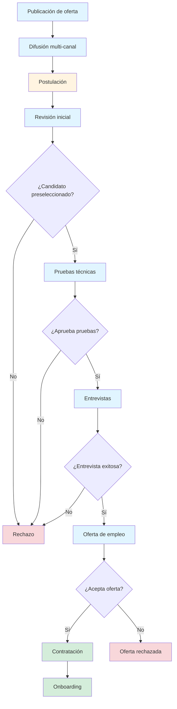

# Especificación del Proyecto: Sistema de Reclutamiento de Talento
 
## Descripción General
 
Sistema de reclutamiento de talento que permite anunciar puestos de trabajo, publicarlos en redes sociales y medios, realizar pruebas a los candidatos, concretar entrevistas y finalmente contratar a candidatos.
 
---
 
## Funcionalidades del Sistema
 
### Alta Prioridad
 
- **Gestión de ofertas de empleo**: Creación, edición, publicación y desactivación de puestos de trabajo con descripción detallada, requisitos, salario y ubicación
- **Gestión de candidatos**: Registro de perfiles, CVs, información de contacto y historial de candidaturas
- **Sistema de postulación**: Formulario de aplicación para candidatos con carga de documentos (CV, carta de presentación)
- **Pipeline de candidatos**: Kanban o flujo de estados (recibido, en revisión, prueba técnica, entrevista, oferta, contratado, rechazado)
- **Filtrado y búsqueda**: Búsqueda de candidatos por habilidades, experiencia, ubicación, educación y otros criterios
 
### Prioridad Media
 
- **Pruebas y evaluaciones**: Creación y asignación de pruebas técnicas, tests de habilidades, cuestionarios psicométricos
- **Gestión de entrevistas**: Programación, calendario, recordatorios, feedback y evaluación post-entrevista
- **Publicación multi-canal**: Integración con redes sociales (LinkedIn, Twitter, Facebook) y portales de empleo
- **Comunicación con candidatos**: Sistema de notificaciones, emails automáticos y mensajería interna
- **Reportes y analytics**: Métricas de tiempo de contratación, calidad de candidatos, fuentes de reclutamiento
 
### Prioridad Baja
 
- **Gestión de ofertas de contratación**: Generación y envío de cartas de oferta, seguimiento de aceptación
- **Onboarding básico**: Checklist de incorporación, documentación legal, asignación de recursos
- **Integraciones**: ATS externos, herramientas de videoconferencia, sistemas de RRHH
- **Colaboración interna**: Comentarios entre reclutadores, asignación de roles, permisos
- **Automatización avanzada**: Workflows personalizados, IA para matching candidato-puesto
 
---
 
## Beneficios de la Integración del Sistema
 
### Para la Empresa
 
- **Reducción del tiempo de contratación**: Automatización de procesos reduce el tiempo desde publicación hasta contratación
- **Mejor calidad de contrataciones**: Sistema de filtrado y evaluaciones permite seleccionar candidatos más alineados con el perfil
- **Reducción de costos**: Menor gasto en publicaciones manuales, procesos administrativos y entrevistas innecesarias
- **Centralización de datos**: Toda la información de candidatos y procesos en un solo lugar, accesible y organizada
- **Mejor employer branding**: Proceso profesional y transparente mejora la imagen de la empresa
- **Métricas y analytics**: Datos para tomar decisiones basadas en evidencia y optimizar el proceso
- **Escalabilidad**: Capacidad de manejar mayor volumen de vacantes sin aumentar proporcionalmente el equipo
- **Cumplimiento normativo**: Registro documentado de todo el proceso de selección
 
### Para los Empleados (Reclutadores/RRHH)
 
- **Ahorro de tiempo administrativo**: Automatización de tareas repetitivas como comunicación y programación
- **Mejor organización**: Pipeline visual permite seguimiento claro del estado de cada candidato
- **Colaboración mejorada**: Comentarios y evaluaciones compartidas facilitan la toma de decisiones en equipo
- **Reducción de carga mental**: Recordatorios automáticos y notificaciones evitan olvidos
- **Acceso a historial**: Información completa de candidatos y procesos anteriores disponible rápidamente
- **Mejor experiencia de usuario**: Interfaz intuitiva reduce la curva de aprendizaje
- **Movilidad**: Acceso desde cualquier lugar para gestionar procesos fuera de la oficina
 
### Para los Candidatos
 
- **Experiencia simplificada**: Proceso de postulación intuitivo y rápido desde cualquier dispositivo
- **Transparencia**: Seguimiento del estado de su candidatura en tiempo real
- **Comunicación oportuna**: Notificaciones automáticas sobre avances en el proceso
- **Accesibilidad**: Disponibilidad 24/7 para revisar y aplicar a ofertas
- **Feedback estructurado**: Evaluaciones objetivas y consistentes para todos los candidatos
- **Reducción de la brecha**: Proceso estandarizado reduce sesgos en la selección
- **Profesionalismo**: Interacción con empresa moderna y tecnológicamente avanzada
- **Reutilización de perfil**: Información guardada para aplicar a futuras vacantes rápidamente
 
---
 
## Flujo del Sistema
 
1. **Publicación de oferta**: La empresa crea y publica una oferta de empleo
2. **Difusión multi-canal**: La oferta se distribuye en redes sociales y portales de empleo
3. **Postulación**: Los candidatos aplican a través del formulario de aplicación
4. **Revisión inicial**: Los reclutadores filtran y revisan las candidaturas recibidas
5. **Pruebas técnicas**: Se asignan y realizan pruebas de evaluación a los candidatos preseleccionados
6. **Entrevistas**: Se programan y realizan entrevistas con los candidatos que pasan las pruebas
7. **Oferta de empleo**: Se envía oferta al candidato seleccionado
8. **Contratación**: Se formaliza la contratación y se inicia el proceso de onboarding

---
 
## Estado del Proyecto
 
- **Especificación funcional**: Completada
- **Análisis de beneficios**: Completado
- **Diseño de diagrama de flujo**: En progreso
- **Desarrollo**: Pendiente

---

## Lean Canvas - Modelo de Negocio LTI

### 1. Problema

**Problemas de los clientes (Empresas/RRHH):**
- Procesos de reclutamiento manuales y lentos
- Dificultad para gestionar grandes volúmenes de candidaturas
- Falta de centralización de información de candidatos
- Tiempos de contratación excesivos
- Ausencia de métricas para optimizar el proceso
- Comunicación fragmentada con candidatos
- Sesgos en la selección por falta de estandarización

**Problemas de los candidatos:**
- Falta de transparencia en el estado de su candidatura
- Procesos de postulación complejos y repetitivos
- Comunicación escasa o nula con las empresas
- Experiencia inconsistente entre diferentes empresas
- Dificultad para reutilizar su perfil en futuras oportunidades

### 2. Segmentos de Clientes

**Segmento Primario:**
- Empresas medianas y grandes (50-5000 empleados)
- Departamentos de RRHH y Talent Acquisition
- Startups en fase de crecimiento
- Agencias de reclutamiento

**Segmento Secundario:**
- Pequeñas empresas (10-50 empleados) con necesidades de hiring
- Consultoras de RRHH
- Empresas con alta rotación de personal

**Usuarios Finales:**
- Reclutadores y RRHH
- Hiring Managers
- Candidatos (usuarios del sistema)

### 3. Propuesta de Valor Única

**Para Empresas:**
- "Reduce tu tiempo de contratación en un 50% con automatización inteligente"
- "Centraliza todo tu proceso de reclutamiento en una plataforma intuitiva"
- "Toma decisiones basadas en datos con analytics en tiempo real"

**Para Candidatos:**
- "Experiencia de postulación transparente y profesional"
- "Seguimiento en tiempo real de tus candidaturas"
- "Un perfil para aplicar a múltiples oportunidades"

**Diferenciadores:**
- IA para matching candidato-puesto
- Colaboración en tiempo real entre reclutadores y managers
- Integración multi-canal nativa
- UX moderna y mobile-first

### 4. Solución

**Plataforma ATS con:**
- Gestión completa del ciclo de vida del candidato
- Pipeline visual tipo Kanban
- Sistema de evaluaciones técnicas integrado
- Programación automatizada de entrevistas
- Publicación multi-canal (redes sociales, portales)
- Sistema de notificaciones y comunicación
- Analytics y reportes avanzados
- IA para preselección y matching
- Portal de onboarding digital

### 5. Canales

**Adquisición de Clientes:**
- Marketing digital (SEO, SEM, LinkedIn Ads)
- Content marketing (blog, webinars, whitepapers)
- Ventas directas B2B
- Partnerships con consultoras de RRHH
- Presencia en eventos de HR Tech
- Free trial / Freemium para captación

**Canales de Distribución:**
- SaaS (Software as a Service) - web
- Demostraciones personalizadas
- Integraciones con herramientas existentes
- Marketplace de integraciones

### 6. Flujos de Ingresos

**Modelo de Suscripción:**
- **Starter**: $299/mes - hasta 50 vacantes activas
- **Professional**: $699/mes - hasta 200 vacantes activas + analytics avanzado
- **Enterprise**: $1,499+/mes - vacantes ilimitadas + API + soporte dedicado

**Ingresos Adicionales:**
- Integraciones premium ($99/mes cada una)
- Evaluaciones técnicas terceras ($5-15 por evaluación)
- Servicios de implementación ($2,000-10,000 one-time)
- Training y consultoría ($150/hora)

### 7. Estructura de Costos

**Costos Fijos:**
- Desarrollo y mantenimiento del software ($15,000-25,000/mes)
- Infraestructura cloud y servidores ($3,000-8,000/mes)
- Salarios del equipo (fundadores + desarrolladores + ventas)
- Oficina y operaciones ($5,000-10,000/mes)

**Costos Variables:**
- Marketing y adquisición de clientes ($500-2,000 por cliente)
- Costos de integraciones terceras
- Comisiones de ventas (10-20%)
- Soporte al cliente escalado

**Costos Únicos:**
- Desarrollo inicial del producto
- Certificaciones y compliance
- Branding y diseño

### 8. Métricas Clave

**Métricas de Adquisición:**
- CAC (Costo de Adquisición de Cliente)
- MRR/ARR (Monthly/Annual Recurring Revenue)
- Tasa de conversión de trial a pago
- Churn rate (tasa de cancelación)

**Métricas de Producto:**
- DAU/MAU (Daily/Monthly Active Users)
- Tiempo promedio de contratación (por cliente)
- Número de vacantes gestionadas
- Tasa de completitud de perfiles de candidatos

**Métricas de Satisfacción:**
- NPS (Net Promoter Score)
- CSAT (Customer Satisfaction Score)
- Tiempo de respuesta a soporte
- Tasa de adopción de funcionalidades

### 9. Ventaja Injusta

**Ventajas Competitivas:**
- **Tecnología propietaria de IA** para matching candidato-puesto
- **Experiencia del equipo** en HR Tech y reclutamiento
- **Integraciones nativas** con principales plataformas (LinkedIn, Indeed, etc.)
- **UX superior** basada en research profundo con usuarios
- **First-mover advantage** en ciertas funcionalidades de automatización
- **Comunidad activa** de reclutadores que generan feedback continuo
- **Data exclusiva** sobre tendencias de reclutamiento

---

## Diagrama Lean Canvas (Tabla)

| **Problema** | **Segmentos de Clientes** | **Propuesta de Valor Única** |
|--------------|---------------------------|------------------------------|
| • Procesos manuales lentos • Falta de centralización • Tiempos excesivos • Sin métricas • Comunicación fragmentada • Sesgos en selección • Falta transparencia candidatos • Procesos complejos postulación | • Empresas 50-5000 empleados • RRHH y Talent Acquisition • Startups en crecimiento • Agencias de reclutamiento • Pequeñas empresas 10-50 • Consultoras RRHH • Reclutadores • Hiring Managers • Candidatos | • Reduce tiempo 50% • Centralización total • Analytics en tiempo real • IA para matching • Colaboración real-time • Experiencia transparente • Seguimiento real-time • Perfil reutilizable |

| **Solución** | **Canales** | **Flujos de Ingresos** |
|---------------|-------------|------------------------|
| • Gestión ciclo completo • Pipeline Kanban • Evaluaciones técnicas • Programación entrevistas • Publicación multi-canal • Notificaciones • Analytics avanzados • IA preselección • Onboarding digital | • Marketing digital • Content marketing • Ventas B2B • Partnerships • Eventos HR Tech • Free trial • SaaS web • Demo personalizadas • Integraciones | • Starter: $299/mes • Professional: $699/mes • Enterprise: $1,499+/mes • Integraciones premium • Evaluaciones técnicas • Implementación • Training |

| **Estructura de Costos** | **Métricas Clave** | **Ventaja Injusta** |
|---------------------------|---------------------|---------------------|
| • Desarrollo: $15-25K/mes • Infraestructura: $3-8K/mes • Salarios equipo • Oficina: $5-10K/mes • Marketing por cliente • Comisiones ventas | • CAC • MRR/ARR • Conversión trial • Churn rate • DAU/MAU • Tiempo contratación • NPS • CSAT | • IA propietaria • Experiencia equipo • Integraciones nativas • UX superior • First-mover • Comunidad activa • Data exclusiva |
