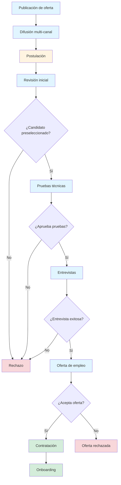
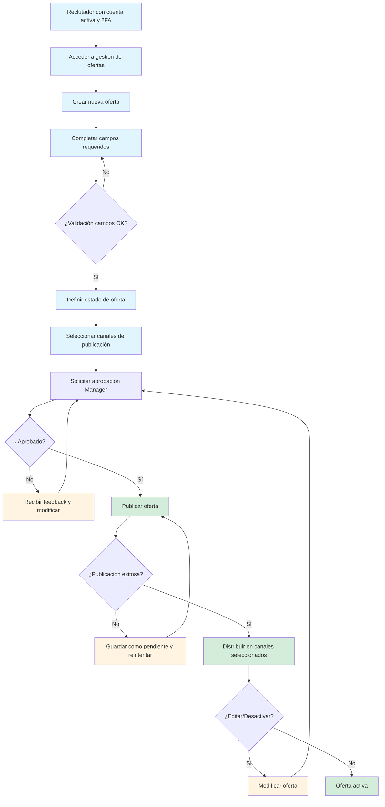
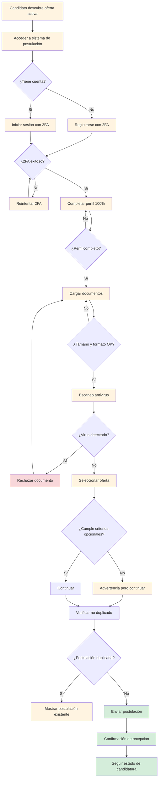
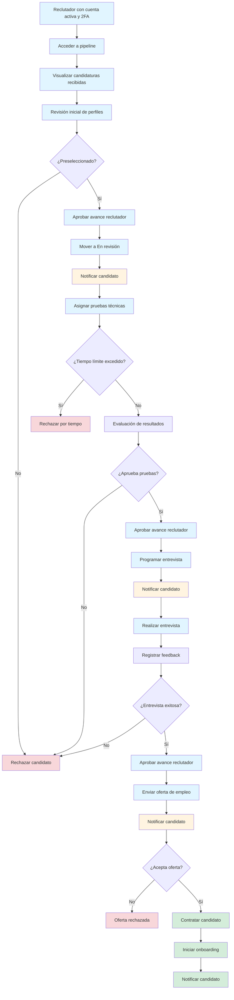

# Especificación del Proyecto: Sistema de Reclutamiento de Talento
 
## Descripción General
 
Sistema de reclutamiento de talento que permite anunciar puestos de trabajo, publicarlos en redes sociales y medios, realizar pruebas a los candidatos, concretar entrevistas y finalmente contratar a candidatos.
 
---
 
## Funcionalidades del Sistema
 
### Alta Prioridad
 
- **Gestión de ofertas de empleo**: Creación, edición, publicación y desactivación de puestos de trabajo con descripción detallada, requisitos, salario y ubicación
- **Gestión de candidatos**: Registro de perfiles, CVs, información de contacto y historial de candidaturas
- **Sistema de postulación**: Formulario de aplicación para candidatos con carga de documentos (CV, carta de presentación)
- **Pipeline de candidatos**: Kanban o flujo de estados (recibido, en revisión, prueba técnica, entrevista, oferta, contratado, rechazado)
- **Filtrado y búsqueda**: Búsqueda de candidatos por habilidades, experiencia, ubicación, educación y otros criterios
 
### Prioridad Media
 
- **Pruebas y evaluaciones**: Creación y asignación de pruebas técnicas, tests de habilidades, cuestionarios psicométricos
- **Gestión de entrevistas**: Programación, calendario, recordatorios, feedback y evaluación post-entrevista
- **Publicación multi-canal**: Integración con redes sociales (LinkedIn, Twitter, Facebook) y portales de empleo
- **Comunicación con candidatos**: Sistema de notificaciones, emails automáticos y mensajería interna
- **Reportes y analytics**: Métricas de tiempo de contratación, calidad de candidatos, fuentes de reclutamiento
 
### Prioridad Baja
 
- **Gestión de ofertas de contratación**: Generación y envío de cartas de oferta, seguimiento de aceptación
- **Onboarding básico**: Checklist de incorporación, documentación legal, asignación de recursos
- **Integraciones**: ATS externos, herramientas de videoconferencia, sistemas de RRHH
- **Colaboración interna**: Comentarios entre reclutadores, asignación de roles, permisos
- **Automatización avanzada**: Workflows personalizados, IA para matching candidato-puesto
 
---
 
## Beneficios de la Integración del Sistema
 
### Para la Empresa
 
- **Reducción del tiempo de contratación**: Automatización de procesos reduce el tiempo desde publicación hasta contratación
- **Mejor calidad de contrataciones**: Sistema de filtrado y evaluaciones permite seleccionar candidatos más alineados con el perfil
- **Reducción de costos**: Menor gasto en publicaciones manuales, procesos administrativos y entrevistas innecesarias
- **Centralización de datos**: Toda la información de candidatos y procesos en un solo lugar, accesible y organizada
- **Mejor employer branding**: Proceso profesional y transparente mejora la imagen de la empresa
- **Métricas y analytics**: Datos para tomar decisiones basadas en evidencia y optimizar el proceso
- **Escalabilidad**: Capacidad de manejar mayor volumen de vacantes sin aumentar proporcionalmente el equipo
- **Cumplimiento normativo**: Registro documentado de todo el proceso de selección
 
### Para los Empleados (Reclutadores/RRHH)
 
- **Ahorro de tiempo administrativo**: Automatización de tareas repetitivas como comunicación y programación
- **Mejor organización**: Pipeline visual permite seguimiento claro del estado de cada candidato
- **Colaboración mejorada**: Comentarios y evaluaciones compartidas facilitan la toma de decisiones en equipo
- **Reducción de carga mental**: Recordatorios automáticos y notificaciones evitan olvidos
- **Acceso a historial**: Información completa de candidatos y procesos anteriores disponible rápidamente
- **Mejor experiencia de usuario**: Interfaz intuitiva reduce la curva de aprendizaje
- **Movilidad**: Acceso desde cualquier lugar para gestionar procesos fuera de la oficina
 
### Para los Candidatos
 
- **Experiencia simplificada**: Proceso de postulación intuitivo y rápido desde cualquier dispositivo
- **Transparencia**: Seguimiento del estado de su candidatura en tiempo real
- **Comunicación oportuna**: Notificaciones automáticas sobre avances en el proceso
- **Accesibilidad**: Disponibilidad 24/7 para revisar y aplicar a ofertas
- **Feedback estructurado**: Evaluaciones objetivas y consistentes para todos los candidatos
- **Reducción de la brecha**: Proceso estandarizado reduce sesgos en la selección
- **Profesionalismo**: Interacción con empresa moderna y tecnológicamente avanzada
- **Reutilización de perfil**: Información guardada para aplicar a futuras vacantes rápidamente
 
---
 
## Flujo del Sistema
 
1. **Publicación de oferta**: La empresa crea y publica una oferta de empleo
2. **Difusión multi-canal**: La oferta se distribuye en redes sociales y portales de empleo
3. **Postulación**: Los candidatos aplican a través del formulario de aplicación
4. **Revisión inicial**: Los reclutadores filtran y revisan las candidaturas recibidas
5. **Pruebas técnicas**: Se asignan y realizan pruebas de evaluación a los candidatos preseleccionados
6. **Entrevistas**: Se programan y realizan entrevistas con los candidatos que pasan las pruebas
7. **Oferta de empleo**: Se envía oferta al candidato seleccionado
8. **Contratación**: Se formaliza la contratación y se inicia el proceso de onboarding

---

## Casos de Uso Principales

### Caso de Uso 1: Gestión de Ofertas de Empleo

**Descripción:**
Este caso de uso permite a los reclutadores y RRHH crear, editar, publicar y gestionar ofertas de empleo en el sistema. Incluye la definición de detalles del puesto, requisitos, salario, ubicación y la publicación en múltiples canales.

**Actores:**
- Reclutador/RRHH
- Hiring Manager

**Estados Previos Requeridos:**
- El reclutador debe tener una cuenta activa con permisos de "Gestión de Ofertas"
- El reclutador debe haber completado la autenticación de doble factor (2FA)
- La empresa debe tener configurados los canales de publicación

**Flujo Principal:**
1. El reclutador accede al módulo de gestión de ofertas
2. Crea una nueva oferta de empleo
3. Completa los campos requeridos (título, descripción, requisitos, salario, ubicación)
4. Define el estado de la oferta (borrador, activa, pausada, cerrada)
5. Selecciona los canales de publicación (redes sociales, portales de empleo)
6. Solicita aprobación del Hiring Manager
7. El Manager aprueba la oferta
8. Publica la oferta
9. La oferta se distribuye en los canales seleccionados
10. El reclutador puede editar o desactivar la oferta en cualquier momento

**Flujos Alternativos:**
- **Flujo Alternativo 1: Rechazo de aprobación**
  - Si el Manager rechaza la oferta, el reclutador recibe notificación con feedback
  - El reclutador puede modificar la oferta y solicitar aprobación nuevamente

- **Flujo Alternativo 2: Edición de oferta publicada**
  - Si el reclutador edita una oferta ya publicada, debe solicitar aprobación nuevamente
  - Los cambios no se aplican hasta la aprobación del Manager

- **Flujo Alternativo 3: Error en publicación de canales**
  - Si falla la publicación en algún canal, el sistema notifica al reclutador
  - La oferta permanece publicada en los canales exitosos
  - El reclutador puede reintentar la publicación en el canal fallido

**Manejo de Errores y Excepciones:**
- **Error de validación de campos**: Si algún campo tiene formato inválido, el sistema muestra error específico y no permite guardar
- **Error de conexión con canales externos**: Si falla la conexión con redes sociales/portales, se guarda la oferta en estado "Pendiente de publicación" y se reintentará automáticamente
- **Error de autenticación 2FA**: Si falla la autenticación, se solicita nuevamente después de 3 intentos fallidos se bloquea temporalmente la cuenta
- **Error de aprobación pendiente**: Si el Manager no responde en 48 horas, se envía recordatorio automático

**Casos Borde:**
- Crear oferta con campos extremadamente largos (límite de caracteres)
- Publicar oferta con salario en formato no estándar
- Editar oferta mientras tiene candidaturas activas
- Desactivar oferta con candidatos en proceso de selección
- Publicar oferta en canales que no están configurados

**Criterios de Aceptación:**
- Todos los campos obligatorios deben estar completos antes de publicarse
- Validación de formato para email (formato estándar RFC 5322)
- Validación de formato para teléfono (números internacionales con código de país)
- Validación de formato para salario (numérico, moneda, periodicidad)
- Requiere aprobación obligatoria del Hiring Manager antes de publicarse
- Sin límite de ofertas activas simultáneas
- Cumplimiento con RGPD: datos sensibles de candidatos no visibles en oferta pública

**Validaciones y Reglas de Negocio:**
- **Validaciones de datos**:
  - Título: 5-100 caracteres, sin caracteres especiales peligrosos
  - Descripción: 50-5000 caracteres, sanitización de HTML
  - Email: formato válido, verificación de dominio
  - Teléfono: formato internacional + código país
  - Salario: numérico positivo, rango válido según mercado
  - Ubicación: validación de código postal/país

- **Reglas de negocio**:
  - Una oferta no puede ser publicada sin aprobación del Manager
  - Las ofertas con candidaturas activas no pueden ser eliminadas, solo desactivadas
  - Los cambios en ofertas publicadas requieren aprobación nuevamente
  - El reclutador debe tener permisos específicos para gestionar ofertas
  - Se debe cumplir con RGPD: no incluir información personal en ofertas públicas

---

### Caso de Uso 2: Postulación de Candidatos

**Descripción:**
Este caso de uso permite a los candidatos registrarse en el sistema, completar su perfil, cargar documentos y postularse a ofertas de empleo disponibles. Incluye el seguimiento del estado de su candidatura en tiempo real.

**Actores:**
- Candidato

**Estados Previos Requeridos:**
- El candidato debe tener una cuenta activa
- El candidato debe haber completado la autenticación de doble factor (2FA)
- El perfil del candidato debe estar 100% completo
- La oferta de empleo debe estar en estado "Activa"

**Flujo Principal:**
1. El candidato descubre una oferta de empleo
2. Accede al sistema de postulación
3. Se registra o inicia sesión con 2FA
4. Completa su perfil al 100% (información personal, experiencia, educación, habilidades)
5. Carga documentos requeridos (CV, carta de presentación)
6. El sistema escanea los documentos con antivirus
7. Si los documentos están limpios, continúa
8. Selecciona la oferta a la que desea postularse
9. Verifica que cumple con criterios opcionales de la oferta (si existen)
10. El sistema verifica que no haya postulación duplicada
11. Envía su postulación
12. Recibe confirmación de recepción
13. Puede seguir el estado de su candidatura en tiempo real

**Flujos Alternativos:**
- **Flujo Alternativo 1: Perfil incompleto**
  - Si el perfil no está 100% completo, el sistema bloquea la postulación
  - Muestra campos faltantes y no permite continuar hasta completarlos

- **Flujo Alternativo 2: Documento con virus detectado**
  - Si el antivirus detecta malware, el documento es rechazado
  - El candidato recibe notificación del problema
  - Debe cargar un documento limpio para continuar

- **Flujo Alternativo 3: Postulación duplicada**
  - Si el candidato ya se postuló a esta oferta, el sistema lo notifica
  - No permite crear una nueva postulación duplicada
  - El candidato puede ver su postulación existente

- **Flujo Alternativo 4: No cumple criterios opcionales**
  - Si la oferta tiene criterios opcionales y el candidato no los cumple
  - El sistema muestra advertencia pero permite postularse
  - El reclutador verá que no cumple los criterios opcionales

**Manejo de Errores y Excepciones:**
- **Error de validación de perfil**: Si el perfil no está 100% completo, el sistema muestra campos faltantes y bloquea postulación
- **Error de tamaño de documento**: Si el documento excede 10MB, el sistema rechaza la carga y muestra mensaje específico
- **Error de formato de archivo**: Si el archivo no es formato permitido (PDF, Word), el sistema rechaza la carga
- **Error de antivirus**: Si el antivirus detecta amenaza, el documento es eliminado y se notifica al candidato
- **Error de autenticación 2FA**: Si falla la autenticación, se solicita nuevamente, después de 3 intentos fallidos se bloquea temporalmente
- **Error de conexión**: Si falla la carga de documentos, se permite reintentar sin perder datos del formulario

**Casos Borde:**
- Cargar documento exactamente de 10MB (límite máximo)
- Intentar postularse a oferta inactiva o cerrada
- Postularse con múltiples documentos simultáneamente
- Intentar postularse sin completar campos opcionales del perfil
- Cargar documento con nombre de archivo extremadamente largo
- Postularse inmediatamente después de registrarse (primer uso)

**Criterios de Aceptación:**
- El perfil debe estar 100% completo para poder postularse
- Límite de 10MB por documento
- Validación de formato de archivos: solo PDF (.pdf), Word (.doc, .docx)
- Revisión por antivirus de todos los documentos cargados
- Sin límite de postulaciones por candidato
- No puede haber postulaciones duplicadas a la misma oferta
- Cumplimiento con RGPD: consentimiento explícito para tratamiento de datos
- Autenticación 2FA obligatoria para acceder al sistema

**Validaciones y Reglas de Negocio:**
- **Validaciones de datos**:
  - Nombre: 2-50 caracteres, solo letras y espacios
  - Email: formato válido RFC 5322, verificación de dominio
  - Teléfono: formato internacional + código país
  - CV: máximo 10MB, formatos PDF/Word
  - Carta de presentación: máximo 10MB, formatos PDF/Word
  - Experiencia: validación de fechas (no futuras)
  - Educación: validación de instituciones y títulos

- **Reglas de negocio**:
  - No puede haber postulaciones duplicadas a la misma oferta
  - Se pueden establecer criterios opcionales para postular (configuración del reclutador)
  - El perfil debe estar 100% completo para postular
  - Todos los documentos pasan por escaneo antivirus
  - Cumplimiento con RGPD: consentimiento explícito, derecho al olvido, portabilidad de datos
  - Autenticación 2FA obligatoria para todas las acciones
  - Los datos del candidato se almacenan encriptados

---

### Caso de Uso 3: Pipeline de Candidatos

**Descripción:**
Este caso de uso permite a los reclutadores gestionar el flujo de candidatos a través de las diferentes etapas del proceso de selección. Incluye la revisión inicial, asignación de pruebas técnicas, programación de entrevistas, envío de ofertas y gestión de contrataciones.

**Actores:**
- Reclutador/RRHH
- Hiring Manager

**Estados Previos Requeridos:**
- El reclutador debe tener una cuenta activa con permisos de "Gestión de Pipeline"
- El reclutador debe haber completado la autenticación de doble factor (2FA)
- Debe haber candidaturas en estado "Recibido" disponibles para revisión
- Los límites de tiempo por etapa deben estar configurados (configuración variable por empresa)

**Flujo Principal:**
1. El reclutador accede al pipeline de candidatos
2. Visualiza las candidaturas en estado "Recibido"
3. Realiza revisión inicial de perfiles
4. Aprueba el avance del candidato (solo requiere aprobación de un reclutador)
5. Mueve candidatos preseleccionados a "En revisión"
6. El sistema envía notificación al candidato del cambio de estado
7. Asigna pruebas técnicas a candidatos cualificados
8. El candidato completa las pruebas dentro del límite de tiempo configurado
9. Evalúa resultados de pruebas
10. Aprueba el avance del candidato
11. Programa entrevistas con candidatos que pasan las pruebas
12. El sistema envía notificación al candidato con detalles de entrevista
13. Realiza entrevistas y registra feedback
14. Aprueba el avance del candidato
15. Envía oferta de empleo al candidato seleccionado
16. El sistema envía notificación al candidato con la oferta
17. Gestiona aceptación/rechazo de oferta
18. Mueve a "Contratado" o "Rechazado" según corresponda
19. El sistema envía notificación final al candidato

**Flujos Alternativos:**
- **Flujo Alternativo 1: Candidato no completa pruebas en tiempo**
  - Si el candidato no completa las pruebas dentro del límite de tiempo configurado
  - El sistema mueve automáticamente al candidato a "Rechazado por tiempo"
  - Se envía notificación al candidato explicando la situación

- **Flujo Alternativo 2: Rechazo en cualquier etapa**
  - Si el reclutador rechaza al candidato en cualquier etapa
  - El candidato se mueve a "Rechazado"
  - Se envía notificación al candidato con feedback (si está configurado)

- **Flujo Alternativo 3: Candidato rechaza oferta**
  - Si el candidato rechaza la oferta de empleo
  - El candidato se mueve a "Oferta rechazada"
  - Se mantiene en el sistema para futuras oportunidades
  - Se envía notificación al reclutador

- **Flujo Alternativo 4: Reconsideración de candidato**
  - Si un candidato fue rechazado pero el reclutador quiere reconsiderarlo
  - El reclutador puede moverlo de vuelta a una etapa anterior
  - Se envía notificación al candidato del cambio de estado

**Manejo de Errores y Excepciones:**
- **Error de límite de tiempo excedido**: Si el candidato excede el tiempo en una etapa, el sistema notifica y puede mover automáticamente a rechazado según configuración
- **Error de notificación fallida**: Si falla el envío de notificación al candidato, el sistema reintentará automáticamente 3 veces
- **Error de autenticación 2FA**: Si falla la autenticación, se solicita nuevamente, después de 3 intentos fallidos se bloquea temporalmente
- **Error de programación de entrevista**: Si falla la integración con calendario externo, se permite programación manual
- **Error de envío de oferta**: Si falla el envío de la oferta por email, se notifica al reclutador para reintentar manualmente
- **Error de cambio de estado no permitido**: Si el reclutador intenta mover un candidato a un estado no válido, el sistema muestra error y bloquea la acción

**Casos Borde:**
- Mover candidato de "Recibido" directamente a "Entrevista" (saltando etapas)
- Configurar límite de tiempo de 0 horas (sin límite)
- Tener múltiples candidatos en la misma etapa simultáneamente
- Rechazar candidato que ya está en "Oferta enviada"
- Mover candidato de "Rechazado" a "Contratado" (flujo reverso)
- Programar entrevista para fecha/hora ya pasada

**Criterios de Aceptación:**
- Límite de tiempo variable y configurable para cada paso del pipeline
- Solo se requiere una aprobación de reclutador para poder avanzar
- Notificaciones obligatorias en cada cambio de estado
- Sin límite de candidatos en las etapas
- Cumplimiento con RGPD: acceso controlado a datos del candidato
- Autenticación 2FA obligatoria para cualquier cambio de estado
- El sistema debe registrar todos los cambios de estado con timestamp y usuario

**Validaciones y Reglas de Negocio:**
- **Validaciones de datos**:
  - Feedback de entrevista: texto libre, máximo 2000 caracteres, sanitización de HTML
  - Calificación de prueba: numérico 0-100, obligatorio para avanzar
  - Fecha de entrevista: no puede ser en el pasado, máximo 6 meses en el futuro
  - Salario de oferta: numérico positivo, rango válido según mercado
  - Notas del reclutador: texto libre, máximo 1000 caracteres

- **Reglas de negocio**:
  - Los límites de tiempo por etapa son configurables por la empresa
  - Solo un reclutador necesita aprobar para avanzar (no requiere aprobación múltiple)
  - Notificaciones automáticas en cada cambio de estado
  - Sin límite de candidatos por etapa
  - Los candidatos rechazados pueden ser reconsiderados (movidos a etapas anteriores)
  - Cumplimiento con RGPD: solo usuarios autorizados pueden ver datos completos del candidato
  - Autenticación 2FA obligatoria para cualquier acción en el pipeline
  - Todos los cambios de estado se registran en auditoría con usuario y timestamp

---

## Estado del Proyecto
 
- **Especificación funcional**: Completada
- **Análisis de beneficios**: Completado
- **Diseño de diagrama de flujo**: En progreso
- **Desarrollo**: Pendiente

---

## Lean Canvas - Modelo de Negocio LTI

### 1. Problema

**Problemas de los clientes (Empresas/RRHH):**
- Procesos de reclutamiento manuales y lentos
- Dificultad para gestionar grandes volúmenes de candidaturas
- Falta de centralización de información de candidatos
- Tiempos de contratación excesivos
- Ausencia de métricas para optimizar el proceso
- Comunicación fragmentada con candidatos
- Sesgos en la selección por falta de estandarización

**Problemas de los candidatos:**
- Falta de transparencia en el estado de su candidatura
- Procesos de postulación complejos y repetitivos
- Comunicación escasa o nula con las empresas
- Experiencia inconsistente entre diferentes empresas
- Dificultad para reutilizar su perfil en futuras oportunidades

### 2. Segmentos de Clientes

**Segmento Primario:**
- Empresas medianas y grandes (50-5000 empleados)
- Departamentos de RRHH y Talent Acquisition
- Startups en fase de crecimiento
- Agencias de reclutamiento

**Segmento Secundario:**
- Pequeñas empresas (10-50 empleados) con necesidades de hiring
- Consultoras de RRHH
- Empresas con alta rotación de personal

**Usuarios Finales:**
- Reclutadores y RRHH
- Hiring Managers
- Candidatos (usuarios del sistema)

### 3. Propuesta de Valor Única

**Para Empresas:**
- "Reduce tu tiempo de contratación en un 50% con automatización inteligente"
- "Centraliza todo tu proceso de reclutamiento en una plataforma intuitiva"
- "Toma decisiones basadas en datos con analytics en tiempo real"

**Para Candidatos:**
- "Experiencia de postulación transparente y profesional"
- "Seguimiento en tiempo real de tus candidaturas"
- "Un perfil para aplicar a múltiples oportunidades"

**Diferenciadores:**
- IA para matching candidato-puesto
- Colaboración en tiempo real entre reclutadores y managers
- Integración multi-canal nativa
- UX moderna y mobile-first

### 4. Solución

**Plataforma ATS con:**
- Gestión completa del ciclo de vida del candidato
- Pipeline visual tipo Kanban
- Sistema de evaluaciones técnicas integrado
- Programación automatizada de entrevistas
- Publicación multi-canal (redes sociales, portales)
- Sistema de notificaciones y comunicación
- Analytics y reportes avanzados
- IA para preselección y matching
- Portal de onboarding digital

### 5. Canales

**Adquisición de Clientes:**
- Marketing digital (SEO, SEM, LinkedIn Ads)
- Content marketing (blog, webinars, whitepapers)
- Ventas directas B2B
- Partnerships con consultoras de RRHH
- Presencia en eventos de HR Tech
- Free trial / Freemium para captación

**Canales de Distribución:**
- SaaS (Software as a Service) - web
- Demostraciones personalizadas
- Integraciones con herramientas existentes
- Marketplace de integraciones

### 6. Flujos de Ingresos

**Modelo de Suscripción:**
- **Starter**: $299/mes - hasta 50 vacantes activas
- **Professional**: $699/mes - hasta 200 vacantes activas + analytics avanzado
- **Enterprise**: $1,499+/mes - vacantes ilimitadas + API + soporte dedicado

**Ingresos Adicionales:**
- Integraciones premium ($99/mes cada una)
- Evaluaciones técnicas terceras ($5-15 por evaluación)
- Servicios de implementación ($2,000-10,000 one-time)
- Training y consultoría ($150/hora)

### 7. Estructura de Costos

**Costos Fijos:**
- Desarrollo y mantenimiento del software ($15,000-25,000/mes)
- Infraestructura cloud y servidores ($3,000-8,000/mes)
- Salarios del equipo (fundadores + desarrolladores + ventas)
- Oficina y operaciones ($5,000-10,000/mes)

**Costos Variables:**
- Marketing y adquisición de clientes ($500-2,000 por cliente)
- Costos de integraciones terceras
- Comisiones de ventas (10-20%)
- Soporte al cliente escalado

**Costos Únicos:**
- Desarrollo inicial del producto
- Certificaciones y compliance
- Branding y diseño

### 8. Métricas Clave

**Métricas de Adquisición:**
- CAC (Costo de Adquisición de Cliente)
- MRR/ARR (Monthly/Annual Recurring Revenue)
- Tasa de conversión de trial a pago
- Churn rate (tasa de cancelación)

**Métricas de Producto:**
- DAU/MAU (Daily/Monthly Active Users)
- Tiempo promedio de contratación (por cliente)
- Número de vacantes gestionadas
- Tasa de completitud de perfiles de candidatos

**Métricas de Satisfacción:**
- NPS (Net Promoter Score)
- CSAT (Customer Satisfaction Score)
- Tiempo de respuesta a soporte
- Tasa de adopción de funcionalidades

### 9. Ventaja Injusta

**Ventajas Competitivas:**
- **Tecnología propietaria de IA** para matching candidato-puesto
- **Experiencia del equipo** en HR Tech y reclutamiento
- **Integraciones nativas** con principales plataformas (LinkedIn, Indeed, etc.)
- **UX superior** basada en research profundo con usuarios
- **First-mover advantage** en ciertas funcionalidades de automatización
- **Comunidad activa** de reclutadores que generan feedback continuo
- **Data exclusiva** sobre tendencias de reclutamiento

---

## Diagrama Lean Canvas (Tabla)

| **Problema** | **Segmentos de Clientes** | **Propuesta de Valor Única** |
|--------------|---------------------------|------------------------------|
| • Procesos manuales lentos • Falta de centralización • Tiempos excesivos • Sin métricas • Comunicación fragmentada • Sesgos en selección • Falta transparencia candidatos • Procesos complejos postulación | • Empresas 50-5000 empleados • RRHH y Talent Acquisition • Startups en crecimiento • Agencias de reclutamiento • Pequeñas empresas 10-50 • Consultoras RRHH • Reclutadores • Hiring Managers • Candidatos | • Reduce tiempo 50% • Centralización total • Analytics en tiempo real • IA para matching • Colaboración real-time • Experiencia transparente • Seguimiento real-time • Perfil reutilizable |

| **Solución** | **Canales** | **Flujos de Ingresos** |
|---------------|-------------|------------------------|
| • Gestión ciclo completo • Pipeline Kanban • Evaluaciones técnicas • Programación entrevistas • Publicación multi-canal • Notificaciones • Analytics avanzados • IA preselección • Onboarding digital | • Marketing digital • Content marketing • Ventas B2B • Partnerships • Eventos HR Tech • Free trial • SaaS web • Demo personalizadas • Integraciones | • Starter: $299/mes • Professional: $699/mes • Enterprise: $1,499+/mes • Integraciones premium • Evaluaciones técnicas • Implementación • Training |

| **Estructura de Costos** | **Métricas Clave** | **Ventaja Injusta** |
|---------------------------|---------------------|---------------------|
| • Desarrollo: $15-25K/mes • Infraestructura: $3-8K/mes • Salarios equipo • Oficina: $5-10K/mes • Marketing por cliente • Comisiones ventas | • CAC • MRR/ARR • Conversión trial • Churn rate • DAU/MAU • Tiempo contratación • NPS • CSAT | • IA propietaria • Experiencia equipo • Integraciones nativas • UX superior • First-mover • Comunidad activa • Data exclusiva |
