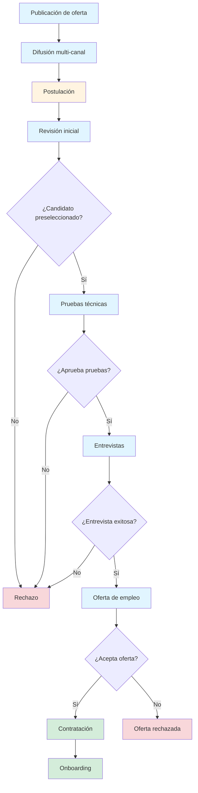

# Prompt 1

Eres un experto en producto, con experiencia en plataformas de reclutamiento de talento.

¿Qué funcionalidades básicas tiene un sistema de reclutamiento de talento en el que se anuncian los puestos de trabajo, se publican en redes sociales y medios, se realizan pruebas a los candidatos, se concretan entrevistas y finalmente se contratan a candidatos?

Descríbelas en un listado, ordenado de mayor a menor prioridad.

---

## Respuesta

# Funcionalidades básicas de un sistema de reclutamiento de talento

## Alta Prioridad

- **Gestión de ofertas de empleo**: Creación, edición, publicación y desactivación de puestos de trabajo con descripción detallada, requisitos, salario y ubicación
- **Gestión de candidatos**: Registro de perfiles, CVs, información de contacto y historial de candidaturas
- **Sistema de postulación**: Formulario de aplicación para candidatos con carga de documentos (CV, carta de presentación)
- **Pipeline de candidatos**: Kanban o flujo de estados (recibido, en revisión, prueba técnica, entrevista, oferta, contratado, rechazado)
- **Filtrado y búsqueda**: Búsqueda de candidatos por habilidades, experiencia, ubicación, educación y otros criterios

## Prioridad Media

- **Pruebas y evaluaciones**: Creación y asignación de pruebas técnicas, tests de habilidades, cuestionarios psicométricos
- **Gestión de entrevistas**: Programación, calendario, recordatorios, feedback y evaluación post-entrevista
- **Publicación multi-canal**: Integración con redes sociales (LinkedIn, Twitter, Facebook) y portales de empleo
- **Comunicación con candidatos**: Sistema de notificaciones, emails automáticos y mensajería interna
- **Reportes y analytics**: Métricas de tiempo de contratación, calidad de candidatos, fuentes de reclutamiento

## Prioridad Baja

- **Gestión de ofertas de contratación**: Generación y envío de cartas de oferta, seguimiento de aceptación
- **Onboarding básico**: Checklist de incorporación, documentación legal, asignación de recursos
- **Integraciones**: ATS externos, herramientas de videoconferencia, sistemas de RRHH
- **Colaboración interna**: Comentarios entre reclutadores, asignación de roles, permisos
- **Automatización avanzada**: Workflows personalizados, IA para matching candidato-puesto

---

# Prompt 2

¿Qué beneficios tiene para la empresa, los empleados y los candidatos la integración de este sistema de reclutamiento?

Descríbelos en un listado, separando los beneficios por cada grupo.

---

## Respuesta

# Beneficios de la integración del sistema de reclutamiento

## Para la Empresa

- **Reducción del tiempo de contratación**: Automatización de procesos reduce el tiempo desde publicación hasta contratación
- **Mejor calidad de contrataciones**: Sistema de filtrado y evaluaciones permite seleccionar candidatos más alineados con el perfil
- **Reducción de costos**: Menor gasto en publicaciones manuales, procesos administrativos y entrevistas innecesarias
- **Centralización de datos**: Toda la información de candidatos y procesos en un solo lugar, accesible y organizada
- **Mejor employer branding**: Proceso profesional y transparente mejora la imagen de la empresa
- **Métricas y analytics**: Datos para tomar decisiones basadas en evidencia y optimizar el proceso
- **Escalabilidad**: Capacidad de manejar mayor volumen de vacantes sin aumentar proporcionalmente el equipo
- **Cumplimiento normativo**: Registro documentado de todo el proceso de selección

## Para los Empleados (Reclutadores/RRHH)

- **Ahorro de tiempo administrativo**: Automatización de tareas repetitivas como comunicación y programación
- **Mejor organización**: Pipeline visual permite seguimiento claro del estado de cada candidato
- **Colaboración mejorada**: Comentarios y evaluaciones compartidas facilitan la toma de decisiones en equipo
- **Reducción de carga mental**: Recordatorios automáticos y notificaciones evitan olvidos
- **Acceso a historial**: Información completa de candidatos y procesos anteriores disponible rápidamente
- **Mejor experiencia de usuario**: Interfaz intuitiva reduce la curva de aprendizaje
- **Movilidad**: Acceso desde cualquier lugar para gestionar procesos fuera de la oficina

## Para los Candidatos

- **Experiencia simplificada**: Proceso de postulación intuitivo y rápido desde cualquier dispositivo
- **Transparencia**: Seguimiento del estado de su candidatura en tiempo real
- **Comunicación oportuna**: Notificaciones automáticas sobre avances en el proceso
- **Accesibilidad**: Disponibilidad 24/7 para revisar y aplicar a ofertas
- **Feedback estructurado**: Evaluaciones objetivas y consistentes para todos los candidatos
- **Reducción de la brecha**: Proceso estandarizado reduce sesgos en la selección
- **Profesionalismo**: Interacción con empresa moderna y tecnológicamente avanzada
- **Reutilización de perfil**: Información guardada para aplicar a futuras vacantes rápidamente

---

# Prompt 3

Describe el customer journey de un candidato que pase por todo el ciclo del proyecto de reclutamiento LTI. Descríbeme paso a paso todas las interacciones desde que descubre la oferta hasta que es contratado (o rechazado).

---

## Respuesta

# Customer Journey del Candidato en el Sistema LTI

## Fase 1: Descubrimiento de la Oferta

**Paso 1: Visualización de la oferta**
- El candidato ve la oferta de empleo publicada en múltiples canales:
  - Redes sociales (LinkedIn, Twitter, Facebook)
  - Portales de empleo
  - Sitio web de la empresa
- Interacción: Clic en el anuncio para ver detalles completos

**Paso 2: Revisión de la oferta**
- El candidato accede a la página de la oferta donde visualiza:
  - Descripción detallada del puesto
  - Requisitos y habilidades necesarias
  - Salario y beneficios
  - Ubicación
  - Información sobre la empresa
- Interacción: Lectura completa y evaluación de alineación con su perfil

## Fase 2: Registro y Postulación

**Paso 3: Registro en el sistema**
- El candidato decide aplicar y se registra en la plataforma:
  - Crea cuenta con email y contraseña
  - Opción de registro con LinkedIn/Google
- Interacción: Formulario de registro con validación de datos

**Paso 4: Completación de perfil**
- El candidato completa su perfil con:
  - Información personal básica
  - Experiencia laboral
  - Educación
  - Habilidades técnicas y blandas
- Interacción: Formularios dinámicos según el tipo de perfil

**Paso 5: Carga de documentos**
- El candidato carga los documentos requeridos:
  - CV (PDF, Word)
  - Carta de presentación
  - Portafolio (si aplica)
  - Certificaciones
- Interacción: Upload de archivos con validación de formato y tamaño

**Paso 6: Envío de postulación**
- El candidato revisa su aplicación antes de enviar
- Interacción: Botón "Enviar postulación" con confirmación
- Recibe notificación de confirmación inmediata

## Fase 3: Seguimiento de Candidatura

**Paso 7: Estado "Recibido"**
- El candidato accede a su panel de candidato
- Visualiza su candidatura en estado "Recibido"
- Interacción: Dashboard con lista de sus postulaciones y estados

**Paso 8: Notificación de revisión**
- Recibe notificación automática cuando la candidatura pasa a "En revisión"
- Canal: Email y notificación en plataforma
- Interacción: Click en notificación para ver detalles

## Fase 4: Evaluación Técnica

**Paso 9: Invitación a prueba técnica**
- Si es preseleccionado, recibe invitación a prueba técnica:
  - Email con instrucciones
  - Fecha límite para completar
  - Enlace a la plataforma de evaluación
- Interacción: Aceptación de la prueba

**Paso 10: Realización de prueba técnica**
- El candidato accede a la plataforma de evaluaciones:
  - Tests de habilidades técnicas
  - Cuestionarios psicométricos
  - Ejercicios prácticos
- Interacción: Navegación por preguntas, respuestas, envío de prueba

**Paso 11: Confirmación de recepción**
- Recibe confirmación de que su prueba fue recibida
- Interacción: Notificación de "Prueba enviada correctamente"

## Fase 5: Entrevista

**Paso 12: Invitación a entrevista**
- Si pasa la prueba técnica, recibe invitación a entrevista:
  - Email con propuesta de fechas/horas
  - Enlace a calendario para agendar
  - Información sobre el formato (video, presencial)
- Interacción: Selección de fecha y hora disponible

**Paso 13: Confirmación de entrevista**
- Recibe confirmación con detalles:
  - Fecha y hora confirmada
  - Enlace a videoconferencia (si aplica)
  - Nombres de los entrevistadores
  - Recordatorio automático 24h antes
- Interacción: Agendar en calendario personal

**Paso 14: Realización de entrevista**
- El candidato asiste a la entrevista:
  - Acceso a plataforma de videoconferencia
  - Compartir pantalla si es necesario
  - Interacción con reclutadores y managers
- Interacción: Conversación, presentación, preguntas y respuestas

## Fase 6: Oferta de Empleo

**Paso 15: Notificación de decisión**
- Recibe notificación sobre el resultado de la entrevista
- Interacción: Email y notificación en plataforma

**Paso 16: Recepción de oferta (si es seleccionado)**
- Si es seleccionado, recibe la oferta formal:
  - Carta de oferta detallada
  - Condiciones salariales y beneficios
  - Fecha de incorporación propuesta
  - Plazo para responder
- Interacción: Revisión detallada de la oferta

**Paso 17: Negociación (opcional)**
- El candidato puede solicitar negociación:
  - A través de mensajería interna
  - O videoconferencia con RRHH
- Interacción: Comunicación bidireccional

**Paso 18: Aceptación de oferta**
- El candidato acepta la oferta:
  - Botón "Aceptar oferta" en plataforma
  - Firma digital de documentos
- Interacción: Confirmación formal de aceptación

## Fase 7: Onboarding

**Paso 19: Inicio de proceso de onboarding**
- El candidato accede al portal de onboarding:
  - Checklist de incorporación
  - Documentación legal requerida
  - Formularios de bienvenida
- Interacción: Completación de tareas pendientes

**Paso 20: Carga de documentación**
- Sube documentos requeridos:
  - DNI/Pasaporte
  - Certificados de estudios
  - Contrato firmado
  - Datos bancarios
- Interacción: Upload de documentos con validación

**Paso 21: Finalización de onboarding**
- Recibe confirmación de que todo está completo
- Interacción: Notificación de "Bienvenido al equipo"

**Paso 22: Primer día**
- El candidato ahora es empleado:
  - Acceso a sistemas internos
  - Asignación de recursos
  - Presentación al equipo
- Interacción: Transición a empleado activo

## Fase Alternativa: Rechazo

**Paso 15-18 (Alternativa): Notificación de rechazo**
- Si no es seleccionado, recibe notificación:
  - Email con feedback (si está configurado)
  - Información sobre el motivo genérico
  - Agradecimiento por el interés
- Interacción: Lectura de notificación
- Su perfil permanece en el sistema para futuras oportunidades

## Puntos de Contacto Clave

1. **Notificaciones automáticas** en cada cambio de estado
2. **Dashboard del candidato** con seguimiento en tiempo real
3. **Mensajería interna** para comunicación directa
4. **Calendario integrado** para gestión de entrevistas
5. **Portal de documentos** centralizado
6. **Feedback estructurado** en cada etapa del proceso

## Canales de Comunicación

- **Email**: Notificaciones importantes y documentación
- **Plataforma web**: Interacción principal
- **Mensajería interna**: Comunicación directa
- **Videoconferencia**: Entrevistas y reuniones
- **Notificaciones push**: Alertas en tiempo real

---

# Prompt 4

Crea un diagrama Lean Canvas para el sistema de reclutamiento LTI (ATS del futuro). El Lean Canvas debe incluir los 9 bloques estándar: Problema, Segmentos de Clientes, Propuesta de Valor Única, Solución, Canales, Flujos de Ingresos, Estructura de Costos, Métricas Clave y Ventaja Injusta. Basa el contenido en las funcionalidades y beneficios descritos anteriormente.

---

## Respuesta

# Lean Canvas - Modelo de Negocio LTI

### 1. Problema

**Problemas de los clientes (Empresas/RRHH):**
- Procesos de reclutamiento manuales y lentos
- Dificultad para gestionar grandes volúmenes de candidaturas
- Falta de centralización de información de candidatos
- Tiempos de contratación excesivos
- Ausencia de métricas para optimizar el proceso
- Comunicación fragmentada con candidatos
- Sesgos en la selección por falta de estandarización

**Problemas de los candidatos:**
- Falta de transparencia en el estado de su candidatura
- Procesos de postulación complejos y repetitivos
- Comunicación escasa o nula con las empresas
- Experiencia inconsistente entre diferentes empresas
- Dificultad para reutilizar su perfil en futuras oportunidades

### 2. Segmentos de Clientes

**Segmento Primario:**
- Empresas medianas y grandes (50-5000 empleados)
- Departamentos de RRHH y Talent Acquisition
- Startups en fase de crecimiento
- Agencias de reclutamiento

**Segmento Secundario:**
- Pequeñas empresas (10-50 empleados) con necesidades de hiring
- Consultoras de RRHH
- Empresas con alta rotación de personal

**Usuarios Finales:**
- Reclutadores y RRHH
- Hiring Managers
- Candidatos (usuarios del sistema)

### 3. Propuesta de Valor Única

**Para Empresas:**
- "Reduce tu tiempo de contratación en un 50% con automatización inteligente"
- "Centraliza todo tu proceso de reclutamiento en una plataforma intuitiva"
- "Toma decisiones basadas en datos con analytics en tiempo real"

**Para Candidatos:**
- "Experiencia de postulación transparente y profesional"
- "Seguimiento en tiempo real de tus candidaturas"
- "Un perfil para aplicar a múltiples oportunidades"

**Diferenciadores:**
- IA para matching candidato-puesto
- Colaboración en tiempo real entre reclutadores y managers
- Integración multi-canal nativa
- UX moderna y mobile-first

### 4. Solución

**Plataforma ATS con:**
- Gestión completa del ciclo de vida del candidato
- Pipeline visual tipo Kanban
- Sistema de evaluaciones técnicas integrado
- Programación automatizada de entrevistas
- Publicación multi-canal (redes sociales, portales)
- Sistema de notificaciones y comunicación
- Analytics y reportes avanzados
- IA para preselección y matching
- Portal de onboarding digital

### 5. Canales

**Adquisición de Clientes:**
- Marketing digital (SEO, SEM, LinkedIn Ads)
- Content marketing (blog, webinars, whitepapers)
- Ventas directas B2B
- Partnerships con consultoras de RRHH
- Presencia en eventos de HR Tech
- Free trial / Freemium para captación

**Canales de Distribución:**
- SaaS (Software as a Service) - web
- Demostraciones personalizadas
- Integraciones con herramientas existentes
- Marketplace de integraciones

### 6. Flujos de Ingresos

**Modelo de Suscripción:**
- **Starter**: $299/mes - hasta 50 vacantes activas
- **Professional**: $699/mes - hasta 200 vacantes activas + analytics avanzado
- **Enterprise**: $1,499+/mes - vacantes ilimitadas + API + soporte dedicado

**Ingresos Adicionales:**
- Integraciones premium ($99/mes cada una)
- Evaluaciones técnicas terceras ($5-15 por evaluación)
- Servicios de implementación ($2,000-10,000 one-time)
- Training y consultoría ($150/hora)

### 7. Estructura de Costos

**Costos Fijos:**
- Desarrollo y mantenimiento del software ($15,000-25,000/mes)
- Infraestructura cloud y servidores ($3,000-8,000/mes)
- Salarios del equipo (fundadores + desarrolladores + ventas)
- Oficina y operaciones ($5,000-10,000/mes)

**Costos Variables:**
- Marketing y adquisición de clientes ($500-2,000 por cliente)
- Costos de integraciones terceras
- Comisiones de ventas (10-20%)
- Soporte al cliente escalado

**Costos Únicos:**
- Desarrollo inicial del producto
- Certificaciones y compliance
- Branding y diseño

### 8. Métricas Clave

**Métricas de Adquisición:**
- CAC (Costo de Adquisición de Cliente)
- MRR/ARR (Monthly/Annual Recurring Revenue)
- Tasa de conversión de trial a pago
- Churn rate (tasa de cancelación)

**Métricas de Producto:**
- DAU/MAU (Daily/Monthly Active Users)
- Tiempo promedio de contratación (por cliente)
- Número de vacantes gestionadas
- Tasa de completitud de perfiles de candidatos

**Métricas de Satisfacción:**
- NPS (Net Promoter Score)
- CSAT (Customer Satisfaction Score)
- Tiempo de respuesta a soporte
- Tasa de adopción de funcionalidades

### 9. Ventaja Injusta

**Ventajas Competitivas:**
- **Tecnología propietaria de IA** para matching candidato-puesto
- **Experiencia del equipo** en HR Tech y reclutamiento
- **Integraciones nativas** con principales plataformas (LinkedIn, Indeed, etc.)
- **UX superior** basada en research profundo con usuarios
- **First-mover advantage** en ciertas funcionalidades de automatización
- **Comunidad activa** de reclutadores que generan feedback continuo
- **Data exclusiva** sobre tendencias de reclutamiento

---

## Diagrama Lean Canvas (Tabla)

| **Problema** | **Segmentos de Clientes** | **Propuesta de Valor Única** |
|--------------|---------------------------|------------------------------|
| • Procesos manuales lentos • Falta de centralización • Tiempos excesivos • Sin métricas • Comunicación fragmentada • Sesgos en selección • Falta transparencia candidatos • Procesos complejos postulación | • Empresas 50-5000 empleados • RRHH y Talent Acquisition • Startups en crecimiento • Agencias de reclutamiento • Pequeñas empresas 10-50 • Consultoras RRHH • Reclutadores • Hiring Managers • Candidatos | • Reduce tiempo 50% • Centralización total • Analytics en tiempo real • IA para matching • Colaboración real-time • Experiencia transparente • Seguimiento real-time • Perfil reutilizable |

| **Solución** | **Canales** | **Flujos de Ingresos** |
|---------------|-------------|------------------------|
| • Gestión ciclo completo • Pipeline Kanban • Evaluaciones técnicas • Programación entrevistas • Publicación multi-canal • Notificaciones • Analytics avanzados • IA preselección • Onboarding digital | • Marketing digital • Content marketing • Ventas B2B • Partnerships • Eventos HR Tech • Free trial • SaaS web • Demo personalizadas • Integraciones | • Starter: $299/mes • Professional: $699/mes • Enterprise: $1,499+/mes • Integraciones premium • Evaluaciones técnicas • Implementación • Training |

| **Estructura de Costos** | **Métricas Clave** | **Ventaja Injusta** |
|---------------------------|---------------------|---------------------|
| • Desarrollo: $15-25K/mes • Infraestructura: $3-8K/mes • Salarios equipo • Oficina: $5-10K/mes • Marketing por cliente • Comisiones ventas | • CAC • MRR/ARR • Conversión trial • Churn rate • DAU/MAU • Tiempo contratación • NPS • CSAT | • IA propietaria • Experiencia equipo • Integraciones nativas • UX superior • First-mover • Comunidad activa • Data exclusiva |

---

# Prompt 5

Crea un diagrama de flujo del sistema con Mermaid. El flujo del sistema está entre las líneas 73 y 82 del documento LTI-ALBB.md. Insertarlo a continuación.

---

## Respuesta

---